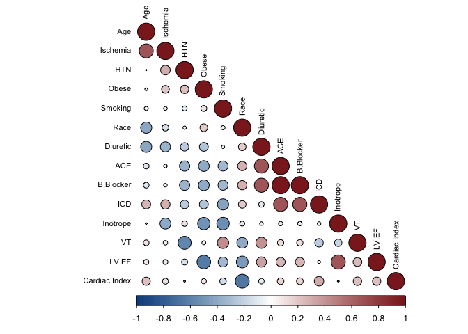
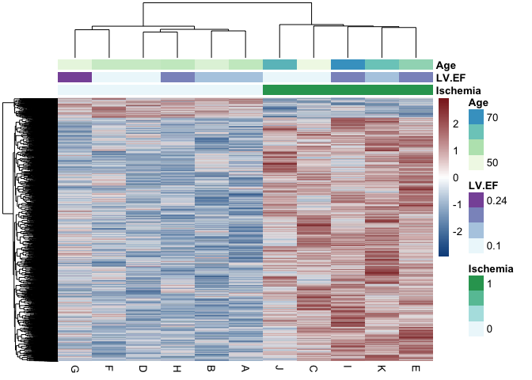
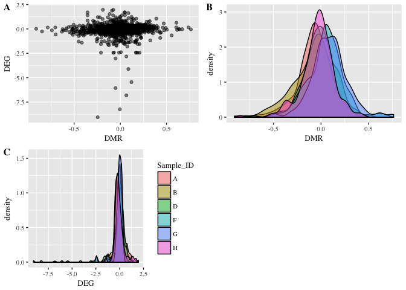
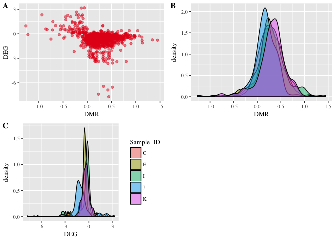
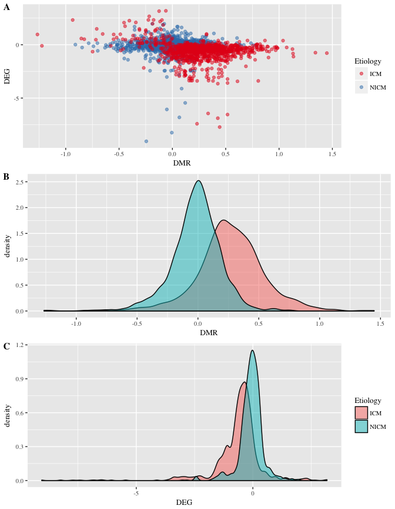
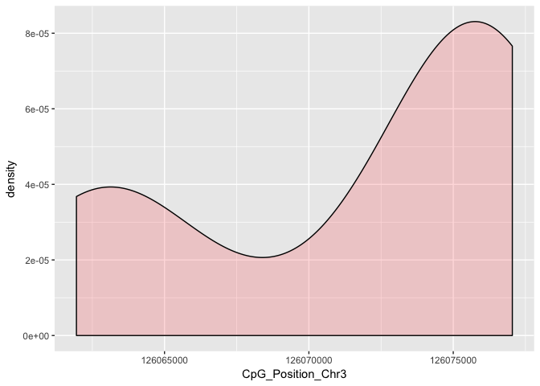
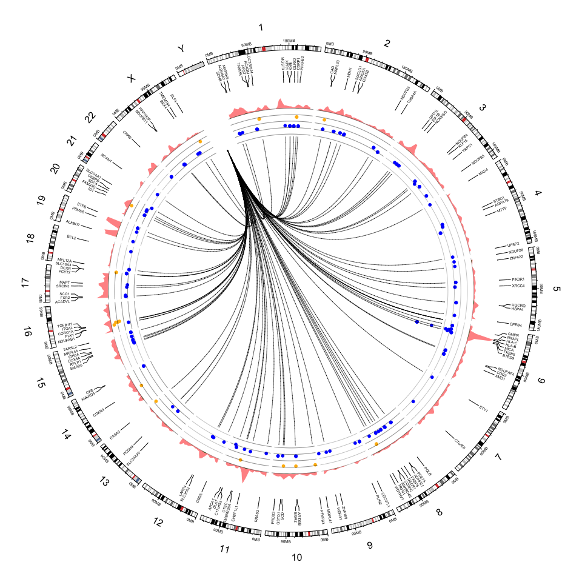
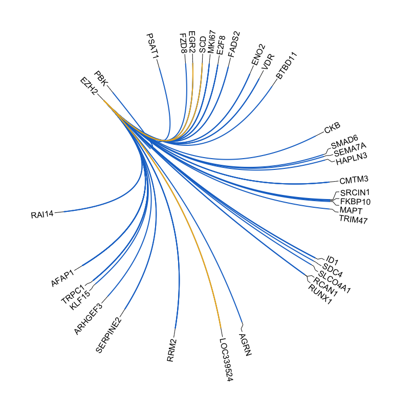

---
# Genome-wide DNA methylation encodes cardiac transcriptional reprogramming in human ischemic heart failure

**Publication**: https://www.nature.com/articles/s41374-018-0104-x 

**Author**: Mark E. Pepin, MS Biomedical Engineering | MD/PhD Trainee  
**Contact**: pepinme@gmail.com  
**Institution**: University of Alabama at Birmingham  
**Location**: 542 Biomedical Research Building 2, Birmingham, AL 35294  

# Introduction

This document summarizes the bioinformatics workflow that Pepin *et al.* used to identify a distinct epigenomic pattern of metabolic reprogramming in human ischemic heart failure vs. non-ischemic heart failure. Most of the analyses were performed in the **r** statistical computing environment; however, multiple LINUX-based analytic tools were also used, and are referenced accordingly.

# Figure 1: Patient Correlation

The first task in this project was to verify that the heart failure patients from which the cardiac tissues were obtained allowed for a simple comparison (i.e. not requiring multiple regression) between Ischemic and Non-Ischemic Cardiomyopathy, as a means of confirming that no confounding variables existed. We conclude that, although patient **Age** is weakly correlated with **Ischemic status**, our sample selection adequately controls for known risk covariates of heart failure and contributors to differential CpG Methylation.


```r
library(readxl)
library(dplyr)
library(Hmisc)
library(corrplot)
library(RColorBrewer)
library(kableExtra)
Patient_Data <- read_xlsx("../1_Input/1_Patient/Patient_Data.xlsx")
Patient_Data<-as.data.frame(Patient_Data)
# Print the table for use
Patient_Data %>% kable(format="latex", 
                       align="c", 
                       booktabs=T, 
                       caption="Patient Characteristics") %>% 
  kable_styling(latex_options=c("striped", 
                                "condensed", 
                                "scale_down"))
```

```r
# Format for Correlation
Patient_Data$Obese<-as.numeric(as.factor(Patient_Data$Obese))
Patient_Data$`Cardiac Index`<-as.numeric(as.factor(Patient_Data$`Cardiac Index`))
Patient_Data[is.na(Patient_Data)]<-""
Patient_Data$`Cardiac Index`<-as.numeric(as.factor(Patient_Data$`Cardiac Index`))
Patient_Data$Inotrope<-as.numeric(as.factor(Patient_Data$Inotrope))
rownames(Patient_Data)<-Patient_Data$Sample_ID
cor<-subset(Patient_Data, select=-c(Sample_ID, Sex))
cor<-data.matrix(cor)
cor.m<-rcorr(cor)
cor.r<-cor(cor)
paletteLength <- 100
myColor <- colorRampPalette(c("dodgerblue4", "white", "brown4"))(paletteLength)
p.mat<-cor.mtest(cor.r)$p
corrplot(cor.r, 
         order="AOE", 
         type="lower", 
         method = "circle", 
         hclust.method = "ward.D2", 
         outline=TRUE, 
         addrect = 3, 
         col = myColor, 
         tl.cex=0.7, 
         tl.col="black",  
         addgrid.col = NA)
```



# Figure 2: RNA Sequencing Analysis

## 2A: Volcano Plot of RNA Sequencing

Volcano plot of differentially expressed genes (DEGs) reveals a modest number of DEGs by Bonferroni-adjusted P value (q-value).  
**hover mouse over marker to see gene information**


```r
library(dplyr)
library(plotly)
#Import data for volcano plot
RNA.DEG.raw<-read.csv("../1_Input/2_RNA/ICM.v.NICM_RNA.csv")
RNA.DEG.Volcano<-RNA.DEG.raw %>% 
    dplyr::select(GeneSymbol=gene, 
                  RNA_FC=log2.fold_change., 
                  p_value)
GeneSymbol<-make.unique(as.character(RNA.DEG.raw$gene), sep="_")
RNA.DEG.Volcano<-RNA.DEG.Volcano %>% 
    dplyr::mutate(RNA_FC=as.numeric(as.character(RNA_FC)), 
                  p_value=as.numeric(p_value))
RNA.DEG.Volcano<-RNA.DEG.Volcano %>% select(GeneSymbol, RNA_FC, p_value)
rownames(RNA.DEG.Volcano)<-GeneSymbol
RNA.DEG.Volcano<-RNA.DEG.Volcano %>% filter(RNA_FC!="NA")
# # Make a basic volcano plot for ND.T2D
with(RNA.DEG.Volcano, plot(RNA_FC, -log10(p_value),
     pch=20, main="Volcano plot", xlim=c(-5,10), ylim=c(0,4.5)))
# Add colored points: red if padj<0.05, orange of RNA_FC>1, green if both)
with(subset(RNA.DEG.Volcano, p_value<.05 & abs(RNA_FC)>1.5),
     points(RNA_FC, -log10(p_value), pch=20, col="coral2"))
```


```r
# Interactive Plot
t <- list(
  family = "times",
  size = 16,
  color = "black")
xax <- list(
  zeroline = TRUE,
  showline = TRUE,
  mirror = "ticks",
  gridcolor = toRGB("gray50"),
  gridwidth = 2,
  zerolinecolor = toRGB("black"),
  zerolinewidth = 4,
  linecolor = toRGB("black"),
  linewidth = 6,
  titlefont=t,
  tickfont=t,
  title=c("RNA Fold-Change")
)
yax <- list(
  zeroline = TRUE,
  showline = TRUE,
  mirror = "ticks",
  gridcolor = toRGB("gray50"),
  gridwidth = 2,
  zerolinecolor = toRGB("black"),
  zerolinewidth = 4,
  linecolor = toRGB("black"),
  linewidth = 6,
  titlefont=t,
  tickfont=t,
  title=c("-Log10(Q-Value")
)
Volcano_plot<-plot_ly(RNA.DEG.Volcano, x = ~RNA_FC, y = ~(-log(p_value)),
          type="scatter",
          text = paste("Gene -", RNA.DEG.Volcano$GeneSymbol,
                       ", Fold-Change -",
                       RNA.DEG.Volcano$RNA_FC,
                       ", p-value -",
                       RNA.DEG.Volcano$p_value),
          mode = "markers", 
          color = ~(-log(p_value)), 
          size = ~(-log(p_value))) %>%
          layout(xaxis=xax, yaxis=yax)
#Volcano_plot
```

## Supplemental Figure: Unsupervised Principle Components Analysis (PCA) of RNA

Principle components analysis (PCA) was used to determine whether RNA sequening alone is sufficient to distinguish between patients with ischemic (ICM) and non-ischemic (NICM) cardiomyopathy. The output figure is capable of 3-dimensional manipulation; regardless, no clear distinctions are seen regardless of viewing angle.  
**change the viewing angle of 3D-PCA by dragging mouse across it.**


```r
library(readxl)
library(dplyr)
library(plotly)
##Import the data to be used for PCA
results_DEG <- read_xlsx("../1_Input/2_RNA/Counts_RNA.xlsx", 
  sheet="Normalized Counts")
results_DEG<-dplyr::select(results_DEG, J:A)
results_DEG<-results_DEG[order(-rowSums(results_DEG)),]
#transpose the dataset (required for PCA)
data.pca<-t(results_DEG)
data.pca<-as.data.frame(data.pca)
##Import the data to be used for annotation
LVAD_Counts_Data <-readxl::read_xlsx("../1_Input/1_Patient/Patient_Data.xlsx")
rownames(LVAD_Counts_Data)<-LVAD_Counts_Data$Sample_ID
Index<-dplyr::select(LVAD_Counts_Data, Ischemia, LV.EF, Age)
Index<-as.data.frame(Index)
##merge the file
data.pca_Final<-merge(Index, data.pca, by=0)
rownames(data.pca_Final)<-data.pca_Final$Row.names
pca.comp<-prcomp(data.pca_Final[,(ncol(Index)+1):ncol(data.pca_Final)])
##Create a 3D-PCA for Inspection
PCs<-merge(pca.comp$x, Index, by=0)
rownames(PCs)<-PCs$Row.names
ax_text<-list(
  family = "times",
  size = 12,
  color = "black")
t <- list(
  family = "times",
  size = 14,
  color = "black")
p <- plot_ly(PCs, x = ~PC1, y = ~PC2, z = ~PC3,
   marker = list(color = ~Ischemia, 
                 colorscale = c('#FFE1A1', '#683531'), 
                 showscale = TRUE), 
   text=rownames(PCs)) %>%
  add_markers() %>% 
  add_text(textfont = t, textposition="bottom") %>%
  layout(scene = list(
     xaxis = list(title = 'PC1', zerolinewidth = 4, 
        zerolinecolor="darkgrey", linecolor="darkgrey", 
        linewidth=4, titlefont=t, tickfont=ax_text),
     yaxis = list(title = 'PC2', zerolinewidth = 4, 
        zerolinecolor="darkgrey", linecolor="darkgrey", 
        linewidth=4, titlefont=t, tickfont=ax_text),
    zaxis = list(title = 'PC3', zerolinewidth = 4, 
        zerolinecolor="darkgrey",  linecolor="darkgrey", 
        linewidth=4, titlefont=t, tickfont=ax_text)),
  annotations = list(
           x = 1.13,
           y = 1.03,
           text = 'Ischemia',
           xref = '1',
           yref = '0',
           showarrow = FALSE,
           plot_bgcolor = 'black'))
p #must comment out for PDF generation via knitr (Pandoc)
```

```r
#Plot Features of the PCA
pcaCharts=function(x) {
    x.var <- x$sdev ^ 2
    x.pvar <- x.var/sum(x.var)
    par(mfrow=c(2,2))
    plot(x.pvar,xlab="Principal component", 
         ylab="Proportion of variance", ylim=c(0,1), type='b')
    plot(cumsum(x.pvar),xlab="Principal component", 
         ylab="Cumulative Proportion of variance", 
         ylim=c(0,1), 
         type='b')
    screeplot(x)
    screeplot(x,type="l")
    par(mfrow=c(1,1))
}
pcaCharts(pca.comp)
```


# Figure 3: DNA Methylation Analysis

## 3A: PCA of Methylation (unfiltered)

Since EZH2 is known to interact with DNMT1, we sought to determine whether the EZH2 induction corresponded with increased promoter-associated CpG methylation, as determined by illumina BeadChip HumanMethylation450k array. THe first step was to determine whether the samples clustered on unsupervised Principal Components Analysis (PCA). 

An unbiased (unsupervised) Principal Components Analysis (PCA) was performed on all CpG Sites interrogated by the HumanMethylation450k array. From this figure, we observe a clear distinction between ICM and NICM, independent of statistical filtering.  
**change the viewing angle of 3D-PCA by dragging mouse across it.**


```r
library(readxl)
library(dplyr)
library(plotly)
##Import Data Matrix
DMR.raw <- read.csv("../1_Input/3_Methylation/LVAD_ICM.v.NICM_Methyl450k.csv")
#Import the Index File
LVAD_Counts_Data <- readxl::read_xlsx("../1_Input/1_Patient/Patient_Data.xlsx")
rownames(LVAD_Counts_Data)<-LVAD_Counts_Data$Sample_ID
Index<-as.data.frame(dplyr::select(LVAD_Counts_Data, Ischemia, LV.EF, Age))
##PCA of raw Annotated Methlyation
All.t<-t(dplyr::select(DMR.raw, J:A))
PCA.All<-prcomp(All.t, scale=TRUE)
data.pca<-PCA.All$x
##merge the file
data.pca_Final<-merge(Index, data.pca, by=0)
rownames(data.pca_Final)<-data.pca_Final$Row.names

pca.comp<-prcomp(data.pca_Final[,(ncol(Index)+1):ncol(data.pca_Final)])

PCs<-merge(pca.comp$x, Index, by=0)
rownames(PCs)<-PCs$Row.names
ax_text<-list(
  family = "times",
  size = 12,
  color = "black")
t <- list(
  family = "times",
  size = 16,
  color = "black")
p <- plot_ly(PCs, x = ~PC1, y = ~PC2, z = ~PC3,
   marker = list(color = ~Ischemia, 
                 colorscale = c('#FFE1A1', '#683531'), 
                 showscale = TRUE), text=rownames(PCs)) %>%
  add_markers() %>% add_text(textfont = t, textposition="bottom") %>%
  layout(scene = list(
                    xaxis = list(title = 'PC1', zerolinewidth = 4, 
                        zerolinecolor="darkgrey", linecolor="darkgrey", 
                        linewidth=4, titlefont=t, tickfont=ax_text),
                    yaxis = list(title = 'PC2', zerolinewidth = 4, 
                        zerolinecolor="darkgrey", linecolor="darkgrey", 
                        linewidth=4, titlefont=t, tickfont=ax_text),
                    zaxis = list(title = 'PC3', zerolinewidth = 4, 
                        zerolinecolor="darkgrey",  linecolor="darkgrey", 
                        linewidth=4, titlefont=t, tickfont=ax_text)),
         annotations = list(
           x = 1.13,
           y = 1.03,
           text = 'Ischemia',
           xref = '1',
           yref = '0',
           showarrow = FALSE,
           plot_bgcolor = 'black'))
p #must comment out for PDF generation via knitr (Pandoc)
```

```r
pcaCharts=function(x) {
    x.var <- x$sdev ^ 2
    x.pvar <- x.var/sum(x.var)
    par(mfrow=c(2,2))
    plot(x.pvar,xlab="Principal component", 
         ylab="Proportion of variance", 
         ylim=c(0,1), type='b')
    plot(cumsum(x.pvar),xlab="Principal component", 
         ylab="Cumulative Proportion of variance", 
         ylim=c(0,1), type='b')
    screeplot(x)
    screeplot(x,type="l")
    par(mfrow=c(1,1))
}
pcaCharts(pca.comp)
```


## 3B: Distribution of Methylation by Genomic and CpG Annotation

The following figure illustrates the enrichment of differential methylation within CpG Islands (CpG-rich regions of the genome, GC% > 60% spanning more than 200 BPs) found within the associated gene promoter.  

**change the viewing angle of 3D-Histogram by dragging mouse across it.**


```r
library(plotly)
library(dplyr)
library(stringr)
library(reshape2)
library(readxl)
library(kableExtra)
paletteLength<-100
myColor <- colorRampPalette(c("dodgerblue4", "white", "brown4"))(paletteLength)
## Create a 3-dimensional Contour Plot
Contour_3D <- read_xlsx("../1_Input/3_Methylation/3D.Histogram_Transposed.xlsx")
rownames(Contour_3D)<-Contour_3D$Gene_Region
Contour_3D<-select(Contour_3D, `North Shelf`:`Open Sea`)
##Make a Table of the CpG Methylation Distribution
Contour_3D %>% kable( align="c", booktabs=T, 
                     caption="Methylation Distribution") %>% 
  kable_styling(latex_options=c("striped", "condensed", "repeat_header"))
```


Table: Methylation Distribution

            North Shelf    North Shore    CpG Island    South Shore    South Shelf    Open Sea 
---------  -------------  -------------  ------------  -------------  -------------  ----------
Promoter        139           3872          11946          3251            109          2241   
TSS1500         82            2647           4994          2305            59           1093   
TSS200          57            1225           6952           946            50           1148   
5' UTR          176           1138           5244          1024            125          1458   
1st Exon        31             379           4284           342            19           618    
Body            512           2154           4927          1741            405          4340   
3' UTR          56             163           228            115            37           438    
Other           418           1174           3002           835            389          3903   

```r
test<-readxl::read_xlsx("../1_Input/3_Methylation/3D.Histogram_Transposed.xlsx", 
                        sheet="Transposed")
test$CpG_Number<-as.numeric(test$CpG_Number)
Hist_3D<-data.matrix(Contour_3D)
rownames(Hist_3D)<-rownames(Contour_3D)
colnames(Hist_3D)<-colnames(Contour_3D)
color <- colorRampPalette(c("grey", "orange", "red"))
t <- list(
  family = "times",
  size = 16,
  color = "black")
q<-plot_ly(z=~Hist_3D, colors=color(10), 
           text=as.character(rownames(Hist_3D))) %>% add_surface() %>% 
   layout(scene = list(
        xaxis = list(title = 'CpG Region', 
                     type="category", 
                     zeroline=TRUE, 
                     showline=TRUE, 
                     zerolinewidth = 4, 
            zerolinecolor="darkgrey", 
            linecolor="darkgrey", 
            linewidth=4, 
            titlefont=t, 
            tickfont=t),
        yaxis = list(title = 'Gene Region', 
                     zerolinewidth = 4, 
                    zerolinecolor="darkgrey", 
                    linecolor="darkgrey", 
                    linewidth=4, 
                    titlefont=t, 
                    tickfont=t),
        zaxis = list(title = 'DMCs', 
                     zerolinewidth = 4, 
                    zerolinecolor="darkgrey",  
                    linecolor="darkgrey", 
                    linewidth=4, 
                    titlefont=t, 
                    tickfont=t)))

q #must comment out for PDF generation via knitr (Pandoc).
```

## 3E: Heatmap and Hierarchical Clustering of Differential Methylation (P<0.05)


```r
library(pheatmap)
library(dplyr)
##Import Data Matrix
# DMR.raw <- read.csv("../1_Input/3_Methylation/LVAD_ICM.v.NICM_Methyl450k.csv")
## Filters to Apply to DMR
pvalue_threshold=0.05
DMP_location="Island"
Gene_region="Promoter_Associated"
##Filter Differential Methylation Data
DMR.p05<-DMR.raw %>% filter(pval<pvalue_threshold)
DMR.p05<-DMR.p05 %>% select(CpG_ProbeID, 
                            IF.vs..NF...Beta, 
                            pval, 
                            qval, 
                            Relation_to_Island, 
                            Regulatory_Feature_Group, 
                            chr, 
                            pos, 
                            J:A)
DMR.p05<-DMR.p05 %>% filter(grepl(DMP_location, Relation_to_Island))
DMR.p05.PromoterCGI<-DMR.p05 %>% filter(grepl(Gene_region, 
                                              Regulatory_Feature_Group))
HM.ICM<-data.matrix(DMR.p05 %>% select(J:A))
#Import the Index File
LVAD_Counts_Data <- readxl::read_xlsx("../1_Input/1_Patient/Patient_Data.xlsx")
Index<-LVAD_Counts_Data %>% select(Ischemia, LV.EF, Age)
Index<-as.data.frame(Index)
rownames(Index)<-LVAD_Counts_Data$Sample_ID
paletteLength <- 100
myColor <- colorRampPalette(c("dodgerblue4", "white", "brown4"))(paletteLength)

myBreaks <- c(seq(min(HM.ICM), 0, length.out=ceiling(paletteLength/2) + 1), 
              seq(max(HM.ICM)/paletteLength, 
                  max(HM.ICM), 
                  length.out=floor(paletteLength/2)))
heatmap_DMC<-pheatmap(HM.ICM, scale="row", 
                      cluster_cols = TRUE, 
                      cluster_rows = TRUE, 
                        color = myColor, 
                        show_rownames = FALSE, 
                        border_color = NA, 
                        annotation_col = Index)
```



# Figure 4: CpG Site Homology: Searching for Consensus Sequences

In order to determine whether the differentially-methylated positions are masking a specific list of upstream regulators, I took all of the promoter-associated CpG islands that are differentially methylated, and I looked within a 20 BP range of them for consensus sequences that are conserved within these transcriptionally-active DMRs. For this process, two approaches were necessary:

1. *De Novo* Motif Discovery
2. Known Motif Enrichment

## Figure 4A: *De Novo* Motif Discovery

To achieve this, the following general steps were necessary: 

1. Filter CpGs by specified criteria in R, exporting the BED-formatted loci.
2. Annotate this BED file using **H**ypergeometric **O**ptimization for **M**otif **E**n**R**ichment ([**HOMER**](http://homer.ucsd.edu/homer/index.html)) via `annotatePearks.pl` command.
3. Find *de novo* motifs using the `findMotifs.pl` command. HOMER offers a number of **Advantages** over other sequence alignment programs:
- CpG content correction (places loci into 'bins' based on CpG content, thereby unbiasing the motif discovery)
- **ZOOPS** (Zero Or One Per Sequence) Scoring coupled with hypergeometric enrichment calculations, comparing to background genomic sequences.
- Direct importation of genomic (.bed) sites (chromosome, chromStart, chromEnd, CpG_ID, [blank], strand).
- Uses customizable indexed FASTA file (hg19 in our case), along with Gene Ontology, relative gene position, etc... associated with most-proximal gene.

The specific workflow for *de novo* motif discovery were as follows:

1. CpG Filter:
- Promoter-Associated CpG Islands, P < 0.05


```r
##Import the Dataset
# DMR.raw <- read.csv("../1_Input/3_Methylation/LVAD_ICM.v.NICM_Methyl450k.csv")
Inverse.DMR.DEG_p05<-read.csv("../1_Input/4_Combined/DEGp05_inverse_Promoter.CGIp05.csv")
## Filters to Apply to DMR
pvalue_threshold=0.05
DMP_location="Island"
Gene_region="Promoter_Associated"
RANGE=10
##Filter Differential Methylation Data
DMR.p05<-dplyr::filter(DMR.raw, 
                       pval<pvalue_threshold)
DMR.p05<-dplyr::filter(DMR.p05, 
                       grepl(DMP_location, Relation_to_Island))
DMR.p05<-dplyr::select(DMR.p05, 
                       CpG_ProbeID, 
                       IF.vs..NF...Beta, 
                       pval, 
                       qval, 
                        Relation_to_Island, 
                       Regulatory_Feature_Group, 
                       chr, 
                       pos, 
                       strand, 
                       J:A)
DMR.p05.PromoterCGI<-dplyr::filter(DMR.p05, 
                                   grepl(Gene_region, 
                                         Regulatory_Feature_Group)
                                   )
#prepare the HOMER input file (BED file format with first 6 columns)
BED<-dplyr::select(DMR.p05, 
                   chrom=chr, 
                   chromStart=pos, 
                   strand, 
                   CpG_ProbeID=CpG_ProbeID)
BED<-dplyr::mutate(BED, end=chromStart+RANGE)
BED<-dplyr::mutate(BED, start=chromStart-RANGE)
BED<-dplyr::select(BED, 
                   chrom, 
                   start, 
                   end, 
                   strand, 
                   CpG_ProbeID)
BED$space<-""
BED<-dplyr::select(BED, 
                   chrom, 
                   start, 
                   end, 
                   CpG_ProbeID ,
                   space, 
                   strand)
##Convert stranded information to factor (+ = 1; - = 0)
BED$strand<-as.numeric(BED$strand)
BED$strand[BED$strand=="2"]<-0
#Write table that will serve as input for the HOMER analysis
library(GenomicRanges)
library(rtracklayer)
write.table(BED, 
    file=paste0("../2_Output/3_Methylation/Sequence.Homology/DMR.10BP_Range.txt"), 
    quote=F, 
    sep="\t", 
    row.names = F, 
    col.names = F)
gr <- GenomicRanges::GRanges(seqnames = Rle(BED$chrom),
              ranges = IRanges(BED$start, end = BED$end, names = BED$CpG_ProbeID))
df <- data.frame(seqnames=seqnames(gr),
                 starts=start(gr)-1,
                 ends=end(gr),
                 names=names(gr))
write.table(df, file=paste0("../2_Output/3_Methylation/Sequence.Homology/",  
                            RANGE,".bed"), 
            quote=F, 
            sep="\t", 
            row.names=F, 
            col.names=F)
library(kableExtra)
BED[1:10,] %>% kable( align="c", booktabs=T, 
    caption="Example HOMER input .BED File") %>% 
    kable_styling(latex_options=c("striped", "condensed", "repeat_header"))
```


Table: Example HOMER input .BED File

 chrom      start         end       CpG_ProbeID    space    strand 
-------  -----------  -----------  -------------  -------  --------
 chr4     165304521    165304541    cg10943359                1    
 chr4     165305012    165305032    cg18685561                1    
 chr4     165304530    165304550    cg21300373                1    
 chr5     126366462    126366482    cg01964720                1    
 chr5     126367239    126367259    cg04284530                0    
 chr5     126365775    126365795    cg08203824                0    
 chr5     126366542    126366562    cg27009633                1    
 chr2     217236989    217237009    cg01380906                1    
 chr2     217237026    217237046    cg14556303                0    
 chr5     10353753     10353773     cg17076397                0    

- Promoter-Associated CpG Islands (P < 0.05) with Inversely Expressed Genes (P<0.05)


```r
##Import the Dataset
Inverse.DMR.DEG_p05<-read.csv("../1_Input/4_Combined/DEGp05_inverse_Promoter.CGIp05.csv")
#prepare the HOMER input file (BED file format with first 6 columns)
BED<-dplyr::select(Inverse.DMR.DEG_p05, 
                   chrom=chrom_DMR, 
                   chromStart=chromStart_DMR, 
                   chromEnd=chromEnd_DMR, 
                   strand=strand_DMR, 
                   CpG_ProbeID=CpG_ProbeID_DEG)
BED<-dplyr::select(BED, chrom, chromStart, chromEnd, strand, CpG_ProbeID)
BED$space<-""
BED<-dplyr::select(BED, 
                   chrom, 
                   chromStart, 
                   chromEnd, 
                   CpG_ProbeID,
                   space, 
                   strand)
##Convert stranded information to factor (+ = 1; - = 0)
BED$strand<-as.numeric(BED$strand)
BED$strand[BED$strand=="2"]<-0
#Write table that will serve as input for the HOMER analysis
write.table(BED, file="../2_Output/3_Methylation/Sequence.Homology/Inverse.p05.txt", 
            quote=F, sep="\t", row.names = F, col.names = F)
library(kableExtra)
BED[1:10,] %>% kable( align="c", booktabs=T, 
        caption="Example HOMER input .BED File of Promoter-associated CpG Islands") %>% 
  kable_styling(latex_options=c("striped", "condensed", "repeat_header"))
```


Table: Example HOMER input .BED File of Promoter-associated CpG Islands

 chrom    chromStart    chromEnd     CpG_ProbeID    space    strand 
-------  ------------  -----------  -------------  -------  --------
 chr10     63663140     63663141     cg00132616                0    
 chr11    116706562     116706563    cg00142925                0    
 chr22     51021411     51021412     cg00533811                0    
 chr10     64577607     64577608     cg00636809                1    
 chr17     7123130       7123131     cg00672228                0    
 chr9     116102525     116102526    cg00824793                1    
 chr6      35655764     35655765     cg00862770                0    
 chr8      82193472     82193473     cg00896540                0    
 chr15     75230058     75230059     cg00926162                1    
 chr2      27440764     27440765     cg01051318                1    

2. Annotate BED file via HOMER:

`annotatePeaks.pl DMR.p05_40BP.txt hg19 -size 20 -hist 20 -annStats stats.txt > output.txt`

3. *De Novo* Motif Discovery via HOMER:

`findMotifsGenome.pl DMR.p05_40BP.txt hg19 Folder_Output/ -size 50 -mask`

## Figure 4B: Known Motif Enrichment

TOMTOM is useful to compare the *de novo* motifs that were generated with the differential methylation dataset.
`tomtom -no-ssc -oc . -verbosity 1 -min-overlap 5 -dist pearson -evalue -thresh 10.0 -xalph query_motifs db/HUMAN/HOCOMOCOv11_full_HUMAN_mono_meme_format.meme db/MOUSE/HOCOMOCOv11_full_MOUSE_mono_meme_format.meme 10 both`


```r
##Import the Methylation Annotations
library(IlluminaHumanMethylation450kanno.ilmn12.hg19)
library(GenomicRanges)
library(rtracklayer)
##Import the Dataset
# DMR.raw <- read.csv("../1_Input/3_Methylation/LVAD_ICM.v.NICM_Methyl450k.csv")
## Filters to Apply to DMR
pvalue_threshold=0.05
DMP_location="Island"
Gene_region="Promoter_Associated"
##Filter Differential Methylation Data
DMR.p05<-dplyr::filter(DMR.raw, 
                       pval<pvalue_threshold)
DMR.p05<-dplyr::filter(DMR.p05, 
                       grepl(DMP_location, 
                             Relation_to_Island)
                       )
DMR.p05<-dplyr::select(DMR.p05, 
                       CpG_ProbeID, 
                       IF.vs..NF...Beta, 
                       pval, 
                       qval, 
                       Relation_to_Island, 
                       Regulatory_Feature_Group, 
                       chr, 
                       pos, 
                       strand, 
                       J:A)
DMR.p05.PromoterCGI<-dplyr::filter(DMR.p05, 
                                   grepl(Gene_region, 
                                         Regulatory_Feature_Group)
                                   )
#prepare the HOMER input file (BED file format with first 6 columns)
BED<-dplyr::select(DMR.p05, 
                   chrom=chr, 
                   chromStart=pos, 
                   strand, 
                   CpG_ProbeID=CpG_ProbeID)
BED<-dplyr::mutate(BED, end=chromStart+1)
BED<-dplyr::mutate(BED, start=chromStart)
BED<-dplyr::select(BED, 
                   chrom, 
                   start, 
                   end, 
                   strand, 
                   CpG_ProbeID)
BED$space<-""
BED<-dplyr::select(BED, 
                   chrom, 
                   start, 
                   end, 
                   CpG_ProbeID,
                   space, 
                   strand)
##Convert stranded information to factor (+ = 1; - = 0)
BED$strand<-as.numeric(BED$strand)
BED$strand[BED$strand=="2"]<-0
#Write table that will serve as input for the HOMER analysis
write.table(BED, file="../2_Output/3_Methylation/Sequence.Homology/DMR.p05_40BP.txt", 
            quote=F, 
            sep="\t", 
            row.names = F, 
            col.names = F)
```

\pagebreak

#Figure 5: Correlation between DEGs and DMPs

##5A: DMR vs. DEG: NICM Patients (n = 6)


```r
library(ggplot2)
library(gridExtra)
library(ggpubr)
library(readxl)
Inverse.DMR.DEG_p05<-read_xlsx("../3_Results/Patientwise_ScatterPlot.xlsx", 
                               sheet="Summary - Scatter")
NICM_A<-dplyr::select(Inverse.DMR.DEG_p05, 
                      GeneSymbol, 
                      DMR=A_DMR,
                      DEG=A_DEG)
NICM_A<-dplyr::mutate(NICM_A, 
                      Sample_ID="A")
NICM_B<-dplyr::select(Inverse.DMR.DEG_p05, 
                      GeneSymbol, 
                      DMR=B_DMR, 
                      DEG=B_DEG)
NICM_B<-dplyr::mutate(NICM_B, 
                      Sample_ID="B")
NICM_D<-dplyr::select(Inverse.DMR.DEG_p05, 
                      GeneSymbol, 
                      DMR=D_DMR, 
                      DEG=D_DEG)
NICM_D<-dplyr::mutate(NICM_D, 
                      Sample_ID="D")
NICM_F<-dplyr::select(Inverse.DMR.DEG_p05, 
                      GeneSymbol, 
                      DMR=F_DMR, 
                      DEG=F_DEG)
NICM_F<-dplyr::mutate(NICM_F, 
                      Sample_ID="F")
NICM_G<-dplyr::select(Inverse.DMR.DEG_p05, 
                      GeneSymbol, 
                      DMR=G_DMR, 
                      DEG=G_DEG)
NICM_G<-dplyr::mutate(NICM_G, 
                      Sample_ID="G")
NICM_H<-dplyr::select(Inverse.DMR.DEG_p05, 
                      GeneSymbol, 
                      DMR=H_DMR, 
                      DEG=H_DEG)
NICM_H<-dplyr::mutate(NICM_H, 
                      Sample_ID="H")
NICM<-rbind(NICM_A, NICM_B)
NICM<-rbind(NICM, NICM_D)
NICM<-rbind(NICM, NICM_F)
NICM<-rbind(NICM, NICM_G)
NICM<-rbind(NICM, NICM_H)
NICM<-dplyr::mutate(NICM, Etiology="NICM")
# scatter plot of x and y variables
# color by groups
scatterPlot <- ggplot(NICM,aes(DMR, DEG)) + 
  geom_point(alpha=0.5) +
    theme(text=element_text(size=10,  family="Times"))
# Marginal density plot of x (top panel)
xdensity <- ggplot(NICM, aes(DMR, fill=Sample_ID)) + 
  geom_density(alpha=.5) +
    theme(text=element_text(size=10,  family="Times"))
# Marginal density plot of y (right panel)
ydensity <- ggplot(NICM, aes(DEG, fill=Sample_ID)) + 
  geom_density(alpha=.5) +
    theme(text=element_text(size=10,  family="Times"))
ggarrange(scatterPlot, xdensity+rremove("legend"), ydensity, 
         labels=c("A", "B", "C"), 
         ncol=2, nrow=2, 
         font.label = list(size=12, face="bold", family="Times"))
```



## 5B: DMR vs. DEG: ICM Patients (n = 5)


```r
###ICM Plots (identical to the NICM 
# except with patients having known ischemic heart disease) 
ICM_C<-dplyr::select(Inverse.DMR.DEG_p05,
    GeneSymbol, DMR=C_DMR,DEG=C_DEG)
ICM_C<-dplyr::mutate(ICM_C, Sample_ID="C")
ICM_E<-dplyr::select(Inverse.DMR.DEG_p05, 
    GeneSymbol, DMR=E_DMR, DEG=E_DEG)
ICM_E<-dplyr::mutate(ICM_E, Sample_ID="E")
ICM_I<-dplyr::select(Inverse.DMR.DEG_p05, 
    GeneSymbol, DMR=I_DMR, DEG=I_DEG)
ICM_I<-dplyr::mutate(ICM_I, Sample_ID="I")
ICM_J<-dplyr::select(Inverse.DMR.DEG_p05, 
    GeneSymbol, DMR=J_DMR, DEG=J_DEG)
ICM_J<-dplyr::mutate(ICM_J, Sample_ID="J")
ICM_K<-dplyr::select(Inverse.DMR.DEG_p05, 
    GeneSymbol, DMR=K_DMR, DEG=K_DEG)
ICM_K<-dplyr::mutate(ICM_K, Sample_ID="K")
ICM<-rbind(ICM_C, ICM_E)
ICM<-rbind(ICM, ICM_I)
ICM<-rbind(ICM, ICM_J)
ICM<-rbind(ICM, ICM_K)
ICM<-dplyr::mutate(ICM, Etiology="ICM")
# scatter plot of x and y variables

# color by groups
scatterPlot <- ggplot(ICM,aes(DMR, DEG, color=Etiology)) + 
    geom_point(alpha=0.5) +
    scale_color_brewer(palette="Set1") +
    theme(text=element_text(size=10,  family="Times"))
# Marginal density plot of x (top panel)
xdensity <- ggplot(ICM, aes(DMR, fill=Sample_ID)) + 
    geom_density(alpha=.5) +
    scale_color_brewer(palette="Set1") +
    theme(text=element_text(size=10,  family="Times"))
# Marginal density plot of y (right panel)
ydensity <- ggplot(ICM, aes(DEG, fill=Sample_ID)) + 
    geom_density(alpha=.5) +
    scale_color_brewer(palette="Set1") +
    theme(text=element_text(size=10,  family="Times"))
ggarrange(scatterPlot+rremove("legend"), 
          xdensity+rremove("legend"), 
          ydensity, 
         labels=c("A", "B", "C"), 
         ncol=2, nrow=2, 
         font.label = list(size=12, face="bold", family="Times"))
```



## Supplemental: DMR vs. DEG: Combined LVAD patients.


```r
##Combine NICM and ICM to create a synthesized output
LVAD_Total<-rbind(NICM, ICM)
# color by groups
scatterPlot <- ggplot(LVAD_Total,aes(DMR, DEG, color=Etiology)) + 
    geom_point(alpha=0.5) +
    scale_color_brewer(palette="Set1") +
    theme(text=element_text(size=10,  family="Times"))
# Marginal density plot of x (top panel)
xdensity <- ggplot(LVAD_Total, aes(DMR, fill=Etiology)) + 
    geom_density(alpha=.5) +
    scale_color_brewer(palette="Set1") +
    theme(text=element_text(size=10,  family="Times"))

# Marginal density plot of y (right panel)
ydensity <- ggplot(LVAD_Total, aes(DEG, fill=Etiology)) + 
    geom_density(alpha=.5) +
    scale_color_brewer(palette="Set1") +
    theme(text=element_text(size=10,  family="Times"))
ggarrange(scatterPlot, xdensity+rremove("legend"), ydensity, 
         labels=c("A", "B", "C"), 
         ncol=1, nrow=3, 
         font.label = list(size=12, face="bold", family="Times"))
```




## 5C: Candidate Genes KLF15 Promoter Methylation display inverse correlation with Gene Expression

**view patient characteristics by hovering mouse over the marker.**


```r
###### Scatter Plot with marginals #######
library(plotly)
library(dplyr)
library(ggplot2)
library(ggpubr)
Inverse.DMR.DEG_p05<-read.csv("../1_Input/4_Combined/DEGp05_inverse_Promoter.CGIp05.csv")
Inverse.DMR.DEG_p05$GeneSymbol<-make.unique(as.character(Inverse.DMR.DEG_p05$GeneSymbol), 
                                            sep="_")
rownames(Inverse.DMR.DEG_p05)<-Inverse.DMR.DEG_p05$GeneSymbol
###Adjust formatting to evaluate individual genes (use the inverse changes list)##
rownames_DMR<-colnames(select(Inverse.DMR.DEG_p05, J_DMR:A_DMR))
DMRs<-select(Inverse.DMR.DEG_p05, J_DMR:A_DMR)
## Standardize the Methylation by the Non-ischemic Subjects and convert to Percentage
DMR_standard<-DMRs %>% 
    rowwise() %>% 
    dplyr::mutate(Ave=mean(c(G_DMR, 
                             F_DMR, 
                             D_DMR, 
                             B_DMR, 
                             H_DMR, 
                             A_DMR), 
                           na.rm=TRUE))
DMR_standard<-DMR_standard %>% mutate("J"=(100*((J_DMR/Ave)-1)))
DMR_standard<-DMR_standard %>% mutate("K"=(100*((K_DMR/Ave)-1)))
DMR_standard<-DMR_standard %>% mutate("C"=(100*((C_DMR/Ave)-1)))
DMR_standard<-DMR_standard %>% mutate("E"=(100*((E_DMR/Ave)-1)))
DMR_standard<-DMR_standard %>% mutate("I"=(100*((I_DMR/Ave)-1)))
DMR_standard<-DMR_standard %>% mutate("G"=(100*((G_DMR/Ave)-1)))
DMR_standard<-DMR_standard %>% mutate("F"=(100*((F_DMR/Ave)-1)))
DMR_standard<-DMR_standard %>% mutate("D"=(100*((D_DMR/Ave)-1)))
DMR_standard<-DMR_standard %>% mutate("B"=(100*((B_DMR/Ave)-1)))
DMR_standard<-DMR_standard %>% mutate("H"=(100*((H_DMR/Ave)-1)))
DMR_standard<-DMR_standard %>% mutate("A"=(100*((A_DMR/Ave)-1)))
DMR_standard<-dplyr::select(DMR_standard, J:A)
rownames(DMR_standard)<-Inverse.DMR.DEG_p05$GeneSymbol
DMRs_t<-t(DMR_standard) #transpose data
colnames(DMRs_t)<-paste0(rownames(DMR_standard), "_DMR")
rownames(DMRs_t)<-sub("_DMR", "", colnames(DMRs))
## Differentially Expressed Genes
DEGs<-select(Inverse.DMR.DEG_p05, J_DEG:A_DEG)
rownames(DEGs)<-Inverse.DMR.DEG_p05$GeneSymbol
DEG_standard<-DEGs %>% rowwise() %>% dplyr::mutate(Ave=mean(c(G_DEG, 
                                                              G_DEG, 
                                                              D_DEG, 
                                                              B_DEG, 
                                                              H_DEG, 
                                                              A_DEG), 
                                                            na.rm=TRUE))
DEG_standard<-DEG_standard %>% mutate("J"=(log2(J_DEG/Ave)))
DEG_standard<-DEG_standard %>% mutate("K"=(log2(K_DEG/Ave)))
DEG_standard<-DEG_standard %>% mutate("C"=(log2(C_DEG/Ave)))
DEG_standard<-DEG_standard %>% mutate("E"=(log2(E_DEG/Ave)))
DEG_standard<-DEG_standard %>% mutate("I"=(log2(I_DEG/Ave)))
DEG_standard<-DEG_standard %>% mutate("G"=(log2(G_DEG/Ave)))
DEG_standard<-DEG_standard %>% mutate("F"=(log2(F_DEG/Ave)))
DEG_standard<-DEG_standard %>% mutate("D"=(log2(D_DEG/Ave)))
DEG_standard<-DEG_standard %>% mutate("B"=(log2(B_DEG/Ave)))
DEG_standard<-DEG_standard %>% mutate("H"=(log2(H_DEG/Ave)))
DEG_standard<-DEG_standard %>% mutate("A"=(log2(A_DEG/Ave)))
DEG_standard<-dplyr::select(DEG_standard, J:A)
rownames(DEG_standard)<-Inverse.DMR.DEG_p05$GeneSymbol
DEGs_t<-t(DEG_standard) #transpose data
colnames(DEGs_t)<-paste0(rownames(DEG_standard), "_DEG")
rownames(DEGs_t)<-sub("_DEG", "", colnames(DEGs))
##

#Import Index
Index<- readxl::read_xlsx("../1_Input/1_Patient/Patient_Data.xlsx")
rownames(Index)<-Index$Sample_ID
Scatter_Data<-merge(DMRs_t, DEGs_t, by=0)
Scatter_Data<-as.data.frame(Scatter_Data)
Scatter_Data<-merge(Index, Scatter_Data, by.x="Sample_ID", by.y="Row.names")
Scatter_Data$Etiology<-factor(Scatter_Data$Ischemia)

##Choose a Gene from within the DMR.DEG_inverse dataset
DMRs_list<-select(Scatter_Data, "KLF15_DMR", 
                 "KLF15_DEG", Ischemia)
t <- list(
  family = "times",
  size = 16,
  color = "black")
xax <- list(
  zeroline = TRUE,
  showline = TRUE,
  mirror = "ticks",
  gridcolor = toRGB("gray50"),
  gridwidth = 2,
  zerolinecolor = toRGB("black"),
  zerolinewidth = 4,
  linecolor = toRGB("black"),
  linewidth = 6,
  titlefont=t,
  tickfont=t,
  title="Log2(Percent Methylation)"
)
yax <- list(
  zeroline = TRUE,
  showline = TRUE,
  mirror = "ticks",
  gridcolor = toRGB("gray50"),
  gridwidth = 2,
  zerolinecolor = toRGB("black"),
  zerolinewidth = 4,
  linecolor = toRGB("black"),
  linewidth = 6,
  titlefont=t,
  tickfont=t,
  title="Log2(Fold-Change)"
)
KLF15_plot<-plot_ly(Scatter_Data, x = ~KLF15_DMR, y = ~KLF15_DEG, 
          type="scatter",
          text = paste("Patient:", Scatter_Data$Sample_ID, 
                       ", Ischemic:", 
                       Scatter_Data$Ischemia, 
                       ", Age: ", 
                       Scatter_Data$Age),
         mode = "markers", 
         color = ~Ischemia,
         colors = c("dodgerblue4", "firebrick4"),
         marker=list(size=20, opacity=0.8)
         ) %>%
         layout(xaxis=xax, yaxis=yax)
KLF15_plot
```

```r
regression<-lm(KLF15_DEG~KLF15_DMR, data=DMRs_list)
summary(regression)
```

```
## 
## Call:
## lm(formula = KLF15_DEG ~ KLF15_DMR, data = DMRs_list)
## 
## Residuals:
##      Min       1Q   Median       3Q      Max 
## -2.26561 -0.71502 -0.04725  1.05967  1.42713 
## 
## Coefficients:
##             Estimate Std. Error t value Pr(>|t|)
## (Intercept) -0.57127    0.46745  -1.222    0.253
## KLF15_DMR   -0.01881    0.02002  -0.939    0.372
## 
## Residual standard error: 1.228 on 9 degrees of freedom
## Multiple R-squared:  0.08931,	Adjusted R-squared:  -0.01187 
## F-statistic: 0.8827 on 1 and 9 DF,  p-value: 0.372
```

## 5D: Bubble Plot and Gene Density of KLF15 Differential Methylation

We next wanted to determine whether the top differentially-methylated positions represented larger regions of enhanced methylation change. To test for this, a bubble plot was created for downstream targets of EZH2 and top candidate regulators KLF15. Percent Methylation of all CpG sites interrogated by the HumanMethyl450k array were plotted by genomic locus, with the bubble size proportional to -Log~10~(P Value).

**view DMP properties in ICM vs. NICM by hovering mouse over the marker.**


```r
library(plotly)
########### KLF15
KLF15<-readxl::read_xlsx("../3_Results/KLF_CpGs.xlsx", 
                         sheet="KLF15-Scatter")
# Make scatter plot based on ALL CpG sites associated with gene:
KLF15_plot<-plot_ly(KLF15, 
                    x = ~CpG_Position_Chr3, 
                    y = ~Percent.Methylation, 
          type="scatter", 
          text = paste("CpG Site -", KLF15$CpG_ProbeID, 
                       ", % Methylation -", 
                       KLF15$Percent.Methylation, 
                       ", p-value -", 
                       KLF15$pval),
          mode = "markers", color = ~`-log(p)`, size = ~`-log(p)`)
KLF15_plot
```

```r
KLF15_density<-ggplot(KLF15, aes(CpG_Position_Chr3, 
                fill = Percent.Methylation)) + geom_density(fill = "#ff4d4d", alpha = 0.2)
KLF15_density
```




# Figure 6: Merging RNA Sequencing with DNA Methylation (Inverse Correlation)

The next task was to determine whether the differentially methylated regions with coordinated gene expression associated with either genomic regions or known transcriptional pathways.

## 6A: Circular Genome Plot


```r
##Create the inversely changing Genes and DMRs (Venn Diagram Adaptation)
library(dplyr)
library(data.table)
library(readxl)
#Import the DEG and DMR
# DMR.raw <- read.csv("../1_Input/3_Methylation/LVAD_ICM.v.NICM_Methyl450k.csv")
DEGs <- read.csv("../1_Input/2_RNA/ICM.v.NICM_RNA.csv")
DEG_ncounts<-read_xlsx("../1_Input/2_RNA/Counts_RNA.xlsx", 
                       sheet="Normalized Counts")
DEG_raw<-left_join(DEGs, DEG_ncounts, by="gene_id")
## Filters to Apply
pvalue_threshold=0.05
DMP_location="Island"
Gene_region="Promoter_Associated"
##Filter Differential Methylation Data
DMR.p05<-filter(DMR.raw, pval<pvalue_threshold)
DMR.p05<-dplyr::select(DMR.p05, CpG_ProbeID, 
                       perc.change=IF.vs..NF...Beta, pval, qval, 
                       Relation_to_Island, 
                       Regulatory_Feature_Group, 
                       chrom=chr, chromStart=pos, strand, J:A)
DMR.p05<-filter(DMR.p05, grepl(DMP_location, Relation_to_Island))
DMR.p05.PromoterCGI<-dplyr::filter(DMR.p05, 
                                   grepl(Gene_region, Regulatory_Feature_Group))
colnames(DMR.p05.PromoterCGI)<-paste0(colnames(DMR.p05.PromoterCGI), "_DMR")

##Filter RNA Expression 
DEG.p05<-filter(DEG_raw, p_value<pvalue_threshold)
DEG.p05<-data.table(DEG.p05)
DEG.p05$gene<-as.character(DEG.p05$gene)
DEG.p05.separated<-DEG.p05[, strsplit(gene, ',', fixed=T), by=test_id]
DEG.p05.separated<-distinct(DEG.p05.separated)
DEG.p05.final<-merge(DEG.p05.separated, DEG.p05, by="test_id")
DEG.p05.final$FoldChange<-as.numeric(as.character(DEG.p05.final$FoldChange))
DEG.p05.final$log2.fold_change.<-as.numeric(as.character(DEG.p05.final$log2.fold_change.))
#
##Annotate the RNA Data with CpG_ProbeIDs that match
UCSC_Gene_Ref<-as.character(DMR.raw$UCSC_RefGene_Name)
reference.table<-dplyr::select(DMR.raw, CpG_ProbeID)
reference.table<-data.table(reference.table)
reference.table<-cbind(reference.table, UCSC_Gene_Ref)
reference<-reference.table[, strsplit(UCSC_Gene_Ref, ';', fixed=T), by=CpG_ProbeID]
reference<-distinct(reference)

DEG.p05.Annotated<-dplyr::left_join(DEG.p05.final, reference, by="V1")
DEG.p05.Annotated<-distinct(DEG.p05.Annotated)
colnames(DEG.p05.Annotated)<-paste0(colnames(DEG.p05.Annotated), "_DEG")
#Merge the two datasets
DMR.DEG_p05<-merge(DEG.p05.Annotated, 
                   DMR.p05.PromoterCGI, 
                   by.x='CpG_ProbeID_DEG', 
                   by.y="CpG_ProbeID_DMR")
DMR.DEG_p05<-dplyr::select(DMR.DEG_p05, 
                           GeneSymbol=V1_DEG, 
                           CpG_ProbeID_DEG, 
                           FoldChange_DEG, 
                           p_value_DEG, 
                           q_value_DEG, 
                           perc.change_DMR, 
                           pval_DMR, 
                           chrom_DMR, 
                           chromStart_DMR, 
                           strand_DMR, 
                           J_DEG:A_DEG, 
                           J_DMR:A_DMR)
DMR.DEG_p05$FoldChange.DEG<-as.numeric(as.character(DMR.DEG_p05$FoldChange_DEG))

#Export the large dataset
write.csv(DMR.DEG_p05, "../1_Input/4_Combined/DMR.DEG_Merged at P<0.05.csv")

# filter for only the inversely changing DMRs with DEGs
Inverse.DMR.DEG_p05<-filter(DMR.DEG_p05, 
        (FoldChange_DEG>0 & perc.change_DMR<0) | (FoldChange_DEG<0 & perc.change_DMR>0))
Inverse.DMR.DEG_p05<-dplyr::mutate(Inverse.DMR.DEG_p05, 
                                   chromEnd_DMR=chromStart_DMR+1)
Inverse.UP.DMR.DEG_p05<-dplyr::filter(DMR.DEG_p05, 
                                    FoldChange_DEG>0 & perc.change_DMR<0)
Inverse.DOWN.DMR.DEG_p05<-dplyr::filter(DMR.DEG_p05, 
                                    FoldChange_DEG<0 & perc.change_DMR>0)
Both.UP<-dplyr::filter(Inverse.DOWN.DMR.DEG_p05, 
                                    FoldChange_DEG>0, perc.change_DMR>0)
Both.DOWN<-dplyr::filter(Inverse.DOWN.DMR.DEG_p05, 
                                    FoldChange_DEG<0, perc.change_DMR<0)

write.csv(Both.UP, "../1_Input/4_Combined/DMR.DEG_Both UP_p<0.05.csv", row.names=FALSE)
write.csv(Both.DOWN, "../1_Input/4_Combined/DMR.DEG_Both Down_P<0.05.csv", row.names=FALSE)
write.csv(Inverse.DMR.DEG_p05, "../1_Input/4_Combined/DEGp05_inverse_Promoter.CGIp05.csv", 
          row.names=FALSE)

#Identify the Non-overlapping Genes and DMRs
DEG.ONLY.List<-setdiff(DEG.p05.Annotated$CpG_ProbeID, 
                       DMR.p05.PromoterCGI$CpG_ProbeID)
DMR.ONLY.List<-setdiff(DMR.p05.PromoterCGI$CpG_ProbeID, 
                       DEG.p05.Annotated$CpG_ProbeID)
##Determine the Genes that do NOT have DMRs
test.RNA<-cbind(DEG.ONLY.List, 1)
test.RNA<-as.data.frame(test.RNA)
test.RNA<-distinct(test.RNA)
test.RNA.2<-merge(test.RNA, 
                  DEG.p05.Annotated, 
                  by.x="DEG.ONLY.List", 
                  by.y="CpG_ProbeID_DEG")
test.RNA.3<-select(test.RNA.2, V1_DEG, FoldChange_DEG)
test.RNA.4<-distinct(test.RNA.3)
DEG.ONLY.UP.COUNT<-filter(test.RNA.4, FoldChange_DEG>0)
DEG.ONLY.DOWN.COUNT<-filter(test.RNA.4, FoldChange_DEG<0)
# Determine the DMRs that annotate to genes that are NOT differentially expressed
test.DMR<-cbind(DMR.ONLY.List, 1)
test.DMR<-as.data.frame(test.DMR)
test.DMR<-distinct(test.DMR)
test.DMR.2<-merge(test.DMR, DMR.p05.PromoterCGI, by.x="DMR.ONLY.List", by.y="CpG_ProbeID_DMR")
test.DMR.3<-select(test.DMR.2, DMR.ONLY.List, perc.change_DMR)
test.DMR.4<-distinct(test.DMR.3)
DMR.ONLY.UP.COUNT<-filter(test.DMR.4, perc.change_DMR>0)
DMR.ONLY.DOWN.COUNT<-filter(test.DMR.4, perc.change_DMR<0)
# Inversely Expressed Gene Labels
Gene_Labels<-select(Inverse.DMR.DEG_p05, chrom=chrom_DMR, 
                    chromStart=chromStart_DMR, chromEnd=chromEnd_DMR, GeneSymbol)
Gene_Labels<-arrange(Gene_Labels, chromStart)
Gene_Labels$chrom<-factor(Gene_Labels$chrom, levels=c("chr1", "chr2", "chr3", "chr4", 
                                                      "chr5", "chr6", "chr7", "chr8", 
                                                      "chr9", "chr10", "chr11", "chr12", 
                                                      "chr13", "chr14", "chr15", "chr16", 
                                                      "chr17", "chr18", "chr19", "chr20", 
                                                      "chr21", "chr22", "chr23", "chrX", 
                                                      "chrY"))
Gene_Labels<-Gene_Labels[order(Gene_Labels$chrom),]
Gene_Labels<-Gene_Labels[!duplicated(Gene_Labels[,4]),]

q05<-filter(Inverse.DMR.DEG_p05, q_value_DEG<0.05)
Labels_q05<-select(q05, chrom=chrom_DMR, 
                   chromStart=chromStart_DMR, chromEnd=chromEnd_DMR, GeneSymbol)
Labels_q05<-arrange(Labels_q05, chromStart)
Labels_q05$chrom<-factor(Labels_q05$chrom, levels=c("chr1", "chr2", "chr3", "chr4", 
                                                      "chr5", "chr6", "chr7", "chr8", 
                                                      "chr9", "chr10", "chr11", "chr12", 
                                                      "chr13", "chr14", "chr15", "chr16", 
                                                      "chr17", "chr18", "chr19", "chr20", 
                                                      "chr21", "chr22", "chr23", "chrX", 
                                                      "chrY"))
Labels_q05<-Labels_q05[order(Labels_q05$chrom),]
Labels_q05<-Labels_q05[!duplicated(Labels_q05[,4]),]

#Fold Change UP (RNA)
Gene_FoldChange.UP<-Inverse.UP.DMR.DEG_p05 %>% select(chrom=chrom_DMR, 
                                                      chromStart=chromStart_DMR, FoldChange_DEG)
Gene_FoldChange.UP<-mutate(Gene_FoldChange.UP, chromEnd=chromStart+1)
Gene_FoldChange.UP<-Gene_FoldChange.UP %>% select(chrom, chromStart, chromEnd, FoldChange_DEG)
Gene_FoldChange.UP<-arrange(Gene_FoldChange.UP, chromStart)
Gene_FoldChange.UP$chrom<-factor(Gene_FoldChange.UP$chrom, levels=c("chr1", "chr2", "chr3", "chr4", 
                                                      "chr5", "chr6", "chr7", "chr8", 
                                                      "chr9", "chr10", "chr11", "chr12", 
                                                      "chr13", "chr14", "chr15", "chr16", 
                                                      "chr17", "chr18", "chr19", "chr20", 
                                                      "chr21", "chr22", "chr23", "chrX", 
                                                      "chrY"))
Gene_FoldChange.UP<-Gene_FoldChange.UP[order(Gene_FoldChange.UP$chrom),]
#Fold Change DOWN (RNA)
Gene_FoldChange.DOWN<-Inverse.DOWN.DMR.DEG_p05 %>% select(chrom=chrom_DMR, 
                                                          chromStart=chromStart_DMR, FoldChange_DEG)
Gene_FoldChange.DOWN<-mutate(Gene_FoldChange.DOWN, chromEnd=chromStart+1)
Gene_FoldChange.DOWN<-Gene_FoldChange.DOWN %>% select(chrom, 
                                                      chromStart, chromEnd, FoldChange_DEG)
Gene_FoldChange.DOWN<-arrange(Gene_FoldChange.DOWN, chromStart)
Gene_FoldChange.DOWN$chrom<-factor(Gene_FoldChange.DOWN$chrom, levels=c("chr1", "chr2", "chr3", "chr4", 
                                                      "chr5", "chr6", "chr7", "chr8", 
                                                      "chr9", "chr10", "chr11", "chr12", 
                                                      "chr13", "chr14", "chr15", "chr16", 
                                                      "chr17", "chr18", "chr19", "chr20", 
                                                      "chr21", "chr22", "chr23", "chrX", 
                                                      "chrY"))
Gene_FoldChange.DOWN<-Gene_FoldChange.DOWN[order(Gene_FoldChange.DOWN$chrom),]
##Fold Change List
Gene_FoldChange_List<-list(Gene_FoldChange.UP, Gene_FoldChange.DOWN)

library(circlize)
library(gtools)
library(dplyr)
om = circos.par("track.margin")
oc = circos.par("cell.padding")
circos.par(track.margin = c(0, 0), cell.padding = c(0, 0, 0, 0))
circos.par(start.degree = -250)
circos.initializeWithIdeogram(track.height = 0.05)
### Labels for inversely changing DMRs with DEG
circos.genomicLabels(Gene_Labels, labels.column=4, side='outside', cex=0.38)
## Add CpG Island Lines here (blocks to tell the reader where the CpG Islands are located?)
# Methylation Density
DMR.PerChange<-select(DMR.p05.PromoterCGI, chrom=chrom_DMR, 
                      chromStart=chromStart_DMR, perc.change=perc.change_DMR)
DMR.PerChange<-mutate(DMR.PerChange, chromEnd=chromStart+1)
DMR.PerChange<-select(DMR.PerChange, chrom, chromStart, chromEnd, perc.change)
DMR.PerChange$chrom<-factor(DMR.PerChange$chrom, levels=c("chr1", "chr2", "chr3", "chr4", 
                                                      "chr5", "chr6", "chr7", "chr8", 
                                                      "chr9", "chr10", "chr11", "chr12", 
                                                      "chr13", "chr14", "chr15", "chr16", 
                                                      "chr17", "chr18", "chr19", "chr20", 
                                                      "chr21", "chr22", "chr23", "chrX", 
                                                      "chrY"))
DMR.PerChange<-DMR.PerChange[order(DMR.PerChange$chrom),]
Methyl.UP<-filter(DMR.PerChange, perc.change>0)
Methyl.DOWN<-filter(DMR.PerChange, perc.change<0)
Methyl.List<-list(Methyl.UP, Methyl.DOWN)
circos.genomicDensity(Methyl.List, col=c("#FF000080", "darkgreen"), 
                      track.height=0.1, bg.border=NA)
##DEG with inverse GPI Islands Promoters
circos.genomicTrackPlotRegion(Gene_FoldChange_List, 
                              ylim = c(-4, 4), bg.border=NA,
                              panel.fun = function(region, value, ...) {
 col = ifelse(value[[1]] > 0, "darkgoldenrod1", "blue")
 circos.genomicPoints(region, value, col = col, cex = 0.8, pch = 16)
 cell.xlim = get.cell.meta.data("cell.xlim")
 for(h in c(-4, -2, 0, 2, 4)) {
   circos.lines(cell.xlim, c(h, h), col ="#00000040")
 }
}, track.height = 0.1)

circos.par(track.margin=om, cell.padding=oc)
## Add link for all DEGs with DMRs in promoter CGIs
Link_Anchor <- read.csv("../1_Input/4_Combined/Circos/Link_Anchor.csv")
Link<-read.csv("../1_Input/4_Combined/Circos/Link_DEG.DMR_Promoter.CGI_P<0.05.csv")
Link$chrom<-factor(Link$chrom, levels=c("chr1", "chr2", "chr3", "chr4", 
                                                      "chr5", "chr6", "chr7", "chr8", 
                                                      "chr9", "chr10", "chr11", "chr12", 
                                                      "chr13", "chr14", "chr15", "chr16", 
                                                      "chr17", "chr18", "chr19", "chr20", 
                                                      "chr21", "chr22", "chr23", "chrX", 
                                                      "chrY"))
Link<-Link[order(Link$chrom),]
Link_Anchor<-Link_Anchor[1:nrow(Link),]
circos.genomicLink(Link, Link_Anchor, col="black", lwd=0.5)
```



```r
circos.clear()
```


## 6B: Hierarchical Pathway Analysis of DEGs/DMRs

Pathway Analysis was performed on the 124 genes inversely correlated with 211 DMPs using the **WEB**-based **G**ene **S**e**T** **A**naLysis **T**oolkit [WEBGestalt](http://www.webgestalt.org/option.php).


```r
library(dplyr)
library(readxl)
library(pheatmap)
library(RColorBrewer)
one <- read_xlsx("../1_Input/4_Combined/Webgestalt_Reactome.Analysis/Pathway.Clustering.Input.xlsx", 
                               sheet = "1")

two <- read_xlsx("../1_Input/4_Combined/Webgestalt_Reactome.Analysis/Pathway.Clustering.Input.xlsx", 
                               sheet = "2")

three <- read_xlsx("../1_Input/4_Combined/Webgestalt_Reactome.Analysis/Pathway.Clustering.Input.xlsx", 
                               sheet = "3")

four <- read_xlsx("../1_Input/4_Combined/Webgestalt_Reactome.Analysis/Pathway.Clustering.Input.xlsx", 
                               sheet = "4")

five <- read_xlsx("../1_Input/4_Combined/Webgestalt_Reactome.Analysis/Pathway.Clustering.Input.xlsx", 
                               sheet = "5")
##Combine all of the datasets
total<-full_join(one, two, by='GeneSymbol')
total<-full_join(total, three, by='GeneSymbol')
total<-full_join(total, four, by='GeneSymbol')
total<-full_join(total, five, by='GeneSymbol')
total<-distinct(total)
rownames(total)<-total$GeneSymbol
total<-dplyr::select(total, 
    `TCA Cycle`=FoldChange.DEG_1_TCA.Cycle, 
    `electron transport`=FoldChange.DEG_2_electron.t, 
    `Complex I`=FoldChange.DEG_3_ComplexI, 
    `Pyruvate Metabolism`=FoldChange.DEG.4_Pyruvate, 
    `Mitochondrial Fatty Acid Oxidation`=`FoldChange.DEG_5_Mtx FAO`)
cluster<-total[,2:ncol(total)]
cluster<-data.matrix(cluster)
cluster[is.na(cluster)]<-0
rownames(cluster)<-total$GeneSymbol

##row names to display
row.display<-one
test<-row.display$GeneSymbol

paletteLength <- 100
myColor <- colorRampPalette(c("dodgerblue4", "white", "gold2"))(paletteLength)
# length(breaks) == length(paletteLength) + 1
# use floor and ceiling to deal with even/odd length pallettelengths
myBreaks <- c(min(cluster), 
              seq(-2, 
                  0, 
                  length.out=ceiling(paletteLength/2)), 
              seq(2/paletteLength, 2, 
                  length.out=floor(paletteLength/2)-1), 
              max(cluster))
pheatmap(cluster, 
         cluster_cols=FALSE, 
         border_color=NA, 
         cluster_rows=TRUE, 
         scale = 'none', 
         show_colnames = T, 
         show_rownames = T, 
         color = myColor, 
         breaks = myBreaks)
```

![\label{Hierarchical_Pathway}Gene Ontology Term Enrichment Analysis of the 124 DEGs with inverse DMPs using database via the Webgestalt server. Subsequently, the genes responsible for enriching each pathway were then clustering by Euclidean distance, illustrating how the pathway enrichment is driven by a subset of genes encoding protein subunits of Complex IV. Furthermore, widespread suppression is noted among all aerobic pathways, with the only induced gene associated with lactate and ketone body transport. Heatmap colors represent DEG fold-changes.](Human.ICM_PDF_v4_files/figure-html/Hierarchical_Pathway-1.png)

```r
total %>% kable(format="latex", 
                align="c", 
                booktabs=T, 
                digits=1, 
                caption="Top 5 Gene Ontology Pathways for Differential Gene Expression Inversely Proportional to Differential Methylation") %>%
  kable_styling(latex_options=c("striped", "condensed", "scale_down"))
```

\rowcolors{2}{gray!6}{white}
\begin{table}

\caption{\label{tab:Hierarchical_Pathway}Top 5 Gene Ontology Pathways for Differential Gene Expression Inversely Proportional to Differential Methylation}
\centering
\resizebox{\linewidth}{!}{\begin{tabular}[t]{lccccc}
\hiderowcolors
\toprule
  & TCA Cycle & electron transport & Complex I & Pyruvate Metabolism & Mitochondrial Fatty Acid Oxidation\\
\midrule
\showrowcolors
ADHFE1 & -1.5 &  &  & -1.5 & \\
COX5A & -1.3 & -1.3 &  &  & \\
COX5B & -1.4 & -1.4 &  &  & \\
COX6C & -1.5 & -1.5 &  &  & \\
DLAT & -1.4 &  &  & -1.4 & \\
\addlinespace
ETFB & -1.3 & -1.3 &  &  & \\
IDH3A & -1.4 &  &  & -1.4 & \\
NDUFAB1 & -1.4 & -1.4 & -1.4 &  & -1.4\\
NDUFAF4 & -1.4 & -1.4 & -1.4 &  & \\
NDUFB11 & -1.3 & -1.3 & -1.3 &  & \\
\addlinespace
NDUFB3 & -1.4 & -1.4 & -1.4 &  & \\
NDUFB4 & -1.3 & -1.3 & -1.3 &  & \\
NDUFB5 & -1.4 & -1.4 & -1.4 &  & \\
NDUFS6 & -1.3 & -1.3 & -1.3 &  & \\
SCO1 & -1.3 & -1.3 &  &  & \\
\addlinespace
SDHB & -1.3 & -1.3 &  & -1.3 & \\
SLC16A3 & 1.8 &  &  & 1.8 & \\
SUCLG1 & -1.4 &  &  & -1.4 & \\
UQCRQ & -1.3 & -1.3 &  &  & \\
DECR1 &  &  &  &  & -1.4\\
\addlinespace
ACADM &  &  &  &  & -1.5\\
ACADVL &  &  &  &  & -1.4\\
\bottomrule
\end{tabular}}
\end{table}
\rowcolors{2}{white}{white}

```r
write.csv(cluster, "../2_Output/4_Combined/cluster.csv")
```


# Figure 7: EZH2 as a putative Regulator of DNA Methylation

Based on the analysis of gene expression via RNA sequencing using (2016 [ENCODE](https://www.encodeproject.org) Consortium databased enrichment within [enrichr](http://amp.pharm.mssm.edu/Enrichr/), differential gene expression was found to enrich ChIP-Sequencing dataset for EZH2. Using this information, it was desired to determine whether the downsstream targets are hyper-methylated, as EZH2 induction would theorize. Therefore, the following analysis was performed to subset downstream targets according to relative methylation.


```r
library(data.table)
library(dplyr)
library(readxl)
library(RColorBrewer)
library(pheatmap)
## Load Data for the T2_ND Methyl Analyis
DEG_raw <- read.csv("../1_Input/2_RNA/ICM.v.NICM_RNA.csv")
EZH2_targets <- read_xlsx("../1_Input/2_RNA/Enrichr/ENCODE_TF_ChIP-seq_2015_table.xlsx", 
                          sheet = "EZH2-Targets", col_names = FALSE)
DMR.raw <- read.csv("../1_Input/3_Methylation/LVAD_ICM.v.NICM_Methyl450k.csv")

## Filters to Apply to DMR
pvalue_threshold=0.05
DMP_location="Island"
Gene_region="Promoter_Associated"
##Filter Differential Methylation Data
DMR.p05<-DMR.raw %>% filter(pval<pvalue_threshold)
DMR.p05<-DMR.p05 %>% select(CpG_ProbeID, 
                            IF.vs..NF...Beta, 
                            pval, 
                            qval, 
                            Relation_to_Island, 
                            Regulatory_Feature_Group, 
                            chr, 
                            pos,
                            J:A)
DMR.p05<-DMR.p05 %>% filter(grepl(DMP_location, Relation_to_Island))
DMR.p05.PromoterCGI<-DMR.p05 %>% filter(grepl(Gene_region, Regulatory_Feature_Group))
#annotate the CpGs
UCSC_Gene_Ref<-as.character(DMR.raw$UCSC_RefGene_Name)
reference.table<-DMR.raw %>% select(CpG_ProbeID)
reference.table<-data.table(reference.table)
reference.table<-cbind(reference.table, UCSC_Gene_Ref)
reference<-reference.table[, strsplit(UCSC_Gene_Ref, ';', fixed=T), by=CpG_ProbeID]
reference<-distinct(reference)
DMR.p05.PromoterCGI<-merge(DMR.p05.PromoterCGI, reference, by="CpG_ProbeID")
DMR.p05.PromoterCGI<-DMR.p05.PromoterCGI %>% select(GeneSymbol=V1, 
  CpG_ProbeID, perc.change=IF.vs..NF...Beta, pval_DMR=pval, chrom=chr, chromStart=pos)
DMR.p05.PromoterCGI<-DMR.p05.PromoterCGI %>% mutate(chromEnd=chromStart+1)

##Filter RNA Expression 
DEG.p05<-filter(DEG_raw, q_value<pvalue_threshold)
DEG.p05<-data.table(DEG.p05)
DEG.p05$gene<-as.character(DEG.p05$gene)
DEG.p05.separated<-DEG.p05[, strsplit(gene, ',', fixed=T), by=test_id]
DEG.p05.separated<-distinct(DEG.p05.separated)
DEG.p05.final<-merge(DEG.p05.separated, DEG.p05, by="test_id")
DEG.p05.final$FoldChange<-as.numeric(as.character(DEG.p05.final$FoldChange))
DEG.p05.final$log2.fold_change.<-as.numeric(as.character(DEG.p05.final$log2.fold_change.))

#merge the two to determine DEGs targeted by EZH2
EZH2_DEGs<-merge(EZH2_targets, DEG.p05.final, by.x="X__1", by.y="gene")
EZH2_DMRs<-merge(EZH2_targets, DMR.p05.PromoterCGI, by.x="X__1", by.y="GeneSymbol")
#UP for DMR
EZH2_DMRs.UP<-EZH2_DMRs %>% filter(perc.change>0)
EZH2_DMRs.UP<-EZH2_DMRs.UP %>% mutate(color="red")
EZH2_DMR.Labels_UP<-EZH2_DMRs.UP %>% select(chrom, chromStart, chromEnd, color)
write.csv(EZH2_DMR.Labels_UP, "../1_Input/5_EZH2/EZH2_DMR.Labels_UP.csv", row.names = FALSE)
#DOWN for DMR
EZH2_DMRs.DOWN<-EZH2_DMRs %>% filter(perc.change<0)
EZH2_DMRs.DOWN<-EZH2_DMRs.DOWN %>% mutate(color="blue")
EZH2_DMR.Labels_DOWN<-EZH2_DMRs.DOWN %>% select(chrom, chromStart, chromEnd, color)
write.csv(EZH2_DMR.Labels_DOWN,"../1_Input/5_EZH2/EZH2_DMR.Labels_DOWN.csv", row.names = FALSE)
Gene_Labels<-EZH2_DMRs %>% select(chrom, chromStart, chromEnd, GeneSymbol=X__1)
write.csv(Gene_Labels, "../1_Input/5_EZH2/EZH2_Gene.Labels.csv",  row.names = FALSE)

#create the 'anchor' for the EZH2 gene
EZH2_location<-DMR.raw %>% filter(grepl("EZH2", 
  UCSC_RefGene_Name) & grepl("TSS1500", UCSC_RefGene_Group) & grepl("S_Shore", Relation_to_Island))
EZH2_coordinates<-EZH2_location %>% select(chrom=chr, chromStart=pos)
EZH2_coordinates<-EZH2_coordinates %>% mutate(chromEnd=chromStart+1)
EZH2_Anchor<-EZH2_coordinates[rep(seq_len(nrow(EZH2_coordinates)), 
  times=nrow(rbind(EZH2_DMR.Labels_UP, EZH2_DMR.Labels_DOWN))),]
write.csv(EZH2_Anchor,"../1_Input/5_EZH2/EZH2_Anchor.csv", row.names = FALSE)

#merge together
EZH2_DEG.DMR<-merge(EZH2_DEGs, EZH2_DMRs, by="X__1")

library(circlize)
library(gtools)
library(dplyr)

om = circos.par("track.margin")
oc = circos.par("cell.padding")
circos.par(track.margin = c(0, 0), cell.padding = c(0, 0, 0, 0))
circos.par(start.degree = -70)
circos.initializeWithIdeogram(plotType = NULL)

##EZH2
###labels
Gene_Labels_EZH2<-read.csv("../1_Input/5_EZH2/EZH2_Gene.Labels.csv")
Gene_Labels_EZH2<-arrange(Gene_Labels_EZH2, chromStart)
Gene_Labels_EZH2$chrom<-factor(Gene_Labels_EZH2$chrom, 
                               levels=c("chr1", "chr2", "chr3", "chr4", 
                                                      "chr5", "chr6", "chr7", "chr8", 
                                                      "chr9", "chr10", "chr11", "chr12", 
                                                      "chr13", "chr14", "chr15", "chr16", 
                                                      "chr17", "chr18", "chr19", "chr20", 
                                                      "chr21", "chr22", "chr23", "chrX", 
                                                      "chrY"))
Gene_Labels_EZH2<-Gene_Labels_EZH2[order(Gene_Labels_EZH2$chrom),]
Gene_Labels_EZH2<-Gene_Labels_EZH2[!duplicated(Gene_Labels_EZH2[,4]),]
circos.genomicLabels(Gene_Labels_EZH2, labels.column=4, side='outside', cex=1)

###UP ONLY (to Color RED)
EZH2_DMR.Targets_UP<-read.csv("../1_Input/5_EZH2/EZH2_DMR.Labels_UP.csv")
EZH2_Anchor<-read.csv("../1_Input/5_EZH2/EZH2_Anchor.csv")
EZH2_DMR.Targets_UP$chrom<-factor(EZH2_DMR.Targets_UP$chrom, 
                                  levels=c("chr1", "chr2", "chr3", "chr4", 
                                                      "chr5", "chr6", "chr7", "chr8", 
                                                      "chr9", "chr10", "chr11", "chr12", 
                                                      "chr13", "chr14", "chr15", "chr16", 
                                                      "chr17", "chr18", "chr19", "chr20", 
                                                      "chr21", "chr22", "chr23", "chrX", 
                                                      "chrY"))
EZH2_DMR.Targets_UP<-EZH2_DMR.Targets_UP[order(EZH2_DMR.Targets_UP$chrom),]
circos.genomicLink(EZH2_DMR.Targets_UP, EZH2_Anchor[1:nrow(EZH2_DMR.Targets_UP),], 
                   col="dodgerblue3", lwd=2)

###DOWN ONLY (to Color Green)
EZH2_DMR.Targets_DOWN<-read.csv("../1_Input/5_EZH2/EZH2_DMR.Labels_DOWN.csv")
EZH2_DMR.Targets_DOWN$chrom<-factor(EZH2_DMR.Targets_DOWN$chrom, 
                                    levels=c("chr1", "chr2", "chr3", "chr4", 
                                                      "chr5", "chr6", "chr7", "chr8", 
                                                      "chr9", "chr10", "chr11", "chr12", 
                                                      "chr13", "chr14", "chr15", "chr16", 
                                                      "chr17", "chr18", "chr19", "chr20", 
                                                      "chr21", "chr22", "chr23", "chrX", 
                                                      "chrY"))
EZH2_DMR.Targets_DOWN<-EZH2_DMR.Targets_DOWN[order(EZH2_DMR.Targets_DOWN$chrom),]
circos.genomicLink(EZH2_DMR.Targets_DOWN, EZH2_Anchor[1:nrow(EZH2_DMR.Targets_DOWN),], 
                   col="goldenrod2", lwd=2)
```



# Supplemental Table: R Session Information

All packages and setting are acquired using the following command: 

```r
sinfo<-devtools::session_info()
sinfo$platform
```

```
##  setting  value                       
##  version  R version 3.4.2 (2017-09-28)
##  system   x86_64, darwin15.6.0        
##  ui       X11                         
##  language (EN)                        
##  collate  en_US.UTF-8                 
##  tz       <NA>                        
##  date     2018-01-08
```

```r
sinfo$packages %>% kable( 
                         align="c", 
                         longtable=T, 
                         booktabs=T,
                         caption="Packages and Required Dependencies") %>% 
    kable_styling(latex_options=c("striped", "repeat_header", "condensed"))
```


Table: Packages and Required Dependencies

                   package                       *    version        date                     source               
----------------------------------------------  ---  ----------  ------------  ------------------------------------
                   acepack                             1.4.1      2016-10-29              CRAN (R 3.4.0)           
                   annotate                            1.54.0     2017-04-25               Bioconductor            
                AnnotationDbi                          1.38.2     2017-07-27               Bioconductor            
                  assertthat                           0.2.0      2017-04-11              CRAN (R 3.4.0)           
                  backports                            1.1.1      2017-09-25              CRAN (R 3.4.2)           
                     base                        *     3.4.2      2017-10-04                  local                
                    base64                              2.0       2016-05-10              CRAN (R 3.4.0)           
                  base64enc                            0.1-3      2015-07-28              CRAN (R 3.4.0)           
                   beanplot                             1.2       2014-09-19              CRAN (R 3.4.0)           
                    bindr                               0.1       2016-11-13              CRAN (R 3.4.0)           
                   bindrcpp                      *      0.2       2017-06-17              CRAN (R 3.4.0)           
                   Biobase                       *     2.36.2     2017-05-04               Bioconductor            
                 BiocGenerics                    *     0.22.1     2017-10-07               Bioconductor            
                 BiocParallel                          1.10.1     2017-05-03               Bioconductor            
                   biomaRt                             2.32.1     2017-06-09               Bioconductor            
                  Biostrings                     *     2.44.2     2017-07-21               Bioconductor            
                     bit                               1.1-12     2014-04-09              CRAN (R 3.4.0)           
                    bit64                              0.9-7      2017-05-08              CRAN (R 3.4.0)           
                    bitops                             1.0-6      2013-08-17              CRAN (R 3.4.0)           
                     blob                              1.1.0      2017-06-17              CRAN (R 3.4.0)           
                  bumphunter                     *     1.16.0     2017-04-25               Bioconductor            
                  cellranger                           1.1.0      2016-07-27              CRAN (R 3.4.0)           
                  checkmate                            1.8.5      2017-10-24              CRAN (R 3.4.2)           
                   circlize                      *     0.4.2      2017-11-18              CRAN (R 3.4.2)           
                   cluster                             2.0.6      2017-03-10              CRAN (R 3.4.2)           
                  codetools                            0.2-15     2016-10-05              CRAN (R 3.4.2)           
                  colorspace                           1.3-2      2016-12-14              CRAN (R 3.4.0)           
                   compiler                            3.4.2      2017-10-04                  local                
                   corrplot                      *      0.84      2017-10-16              CRAN (R 3.4.2)           
                   cowplot                             0.9.1      2017-11-16              CRAN (R 3.4.2)           
                  crosstalk                            1.0.0      2016-12-21              CRAN (R 3.4.0)           
                  data.table                     *    1.10.4-3    2017-10-27              CRAN (R 3.4.2)           
                   datasets                      *     3.4.2      2017-10-04                  local                
                     DBI                                0.7       2017-06-18              CRAN (R 3.4.0)           
                 DelayedArray                    *     0.2.7      2017-06-03               Bioconductor            
                   devtools                            1.13.4     2017-11-09              CRAN (R 3.4.2)           
                    digest                             0.6.12     2017-01-27              CRAN (R 3.4.0)           
                    doRNG                              1.6.6      2017-04-10              CRAN (R 3.4.0)           
                    dplyr                        *     0.7.4      2017-09-28              CRAN (R 3.4.2)           
                   evaluate                            0.10.1     2017-06-24              CRAN (R 3.4.1)           
                   foreach                       *     1.4.3      2015-10-13              CRAN (R 3.4.0)           
                   foreign                             0.8-69     2017-06-22              CRAN (R 3.4.2)           
                   Formula                       *     1.2-2      2017-07-10              CRAN (R 3.4.1)           
                  genefilter                           1.58.1     2017-05-06               Bioconductor            
                 GenomeInfoDb                    *     1.12.3     2017-10-05               Bioconductor            
               GenomeInfoDbData                        0.99.0     2017-10-13               Bioconductor            
              GenomicAlignments                        1.12.2     2017-08-19               Bioconductor            
               GenomicFeatures                         1.28.5     2017-09-20               Bioconductor            
                GenomicRanges                    *     1.28.6     2017-10-04               Bioconductor            
                   GEOquery                            2.42.0     2017-04-25               Bioconductor            
                   ggplot2                       *     2.2.1      2016-12-30              CRAN (R 3.4.0)           
                    ggpubr                       *     0.1.6      2017-11-14              CRAN (R 3.4.2)           
                GlobalOptions                          0.0.12     2017-05-21              CRAN (R 3.4.0)           
                     glue                              1.2.0      2017-10-29              CRAN (R 3.4.2)           
                   graphics                      *     3.4.2      2017-10-04                  local                
                  grDevices                      *     3.4.2      2017-10-04                  local                
                     grid                              3.4.2      2017-10-04                  local                
                  gridExtra                      *      2.3       2017-09-09              CRAN (R 3.4.1)           
                    gtable                             0.2.0      2016-02-26              CRAN (R 3.4.0)           
                    gtools                       *     3.5.0      2015-05-29              CRAN (R 3.4.0)           
                    highr                               0.6       2016-05-09              CRAN (R 3.4.0)           
                    Hmisc                        *     4.0-3      2017-05-02              CRAN (R 3.4.0)           
                     hms                               0.4.0      2017-11-23              CRAN (R 3.4.3)           
                  htmlTable                             1.9       2017-01-26              CRAN (R 3.4.0)           
                  htmltools                            0.3.6      2017-04-28              CRAN (R 3.4.0)           
                 htmlwidgets                            0.9       2017-07-10              CRAN (R 3.4.1)           
                    httpuv                             1.3.5      2017-07-04              CRAN (R 3.4.1)           
                     httr                              1.3.1      2017-08-20              CRAN (R 3.4.1)           
 IlluminaHumanMethylation450kanno.ilmn12.hg19    *     0.6.0      2017-11-09               Bioconductor            
                  illuminaio                           0.18.0     2017-04-25               Bioconductor            
                   IRanges                       *     2.10.5     2017-10-08               Bioconductor            
                  iterators                      *     1.0.8      2015-10-13              CRAN (R 3.4.0)           
                   jsonlite                             1.5       2017-06-01              CRAN (R 3.4.0)           
                  kableExtra                     *     0.6.1      2017-11-01              CRAN (R 3.4.2)           
                    knitr                        *      1.17      2017-08-10              CRAN (R 3.4.1)           
                   labeling                             0.3       2014-08-23              CRAN (R 3.4.0)           
                   lattice                       *    0.20-35     2017-03-25              CRAN (R 3.4.2)           
                 latticeExtra                          0.6-28     2016-02-09              CRAN (R 3.4.0)           
                   lazyeval                            0.2.1      2017-10-29              CRAN (R 3.4.2)           
                    limma                             3.32.10     2017-10-13               Bioconductor            
                    locfit                       *    1.5-9.1     2013-04-20              CRAN (R 3.4.0)           
                   magrittr                      *      1.5       2014-11-22              CRAN (R 3.4.0)           
                     MASS                              7.3-47     2017-02-26              CRAN (R 3.4.2)           
                    Matrix                             1.2-12     2017-11-15              CRAN (R 3.4.2)           
                 matrixStats                     *     0.52.2     2017-04-14              CRAN (R 3.4.0)           
                    mclust                              5.4       2017-11-22              CRAN (R 3.4.3)           
                   memoise                             1.1.0      2017-04-21              CRAN (R 3.4.0)           
                   methods                       *     3.4.2      2017-10-04                  local                
                     mime                               0.5       2016-07-07              CRAN (R 3.4.0)           
                    minfi                        *     1.22.1     2017-05-02               Bioconductor            
                   multtest                            2.32.0     2017-04-25               Bioconductor            
                   munsell                             0.4.3      2016-02-13              CRAN (R 3.4.0)           
                     nlme                             3.1-131     2017-02-06              CRAN (R 3.4.2)           
                     nnet                              7.3-12     2016-02-02              CRAN (R 3.4.2)           
                   nor1mix                             1.2-3      2017-08-30              CRAN (R 3.4.1)           
                   openssl                             0.9.9      2017-11-10              CRAN (R 3.4.2)           
                   parallel                      *     3.4.2      2017-10-04                  local                
                   pheatmap                      *     1.0.8      2015-12-11              CRAN (R 3.4.0)           
                  pkgconfig                            2.0.1      2017-03-21              CRAN (R 3.4.0)           
                   pkgmaker                             0.22      2014-05-14              CRAN (R 3.4.0)           
                    plotly                       *     4.7.1      2017-07-29              CRAN (R 3.4.1)           
                     plyr                              1.8.4      2016-06-08              CRAN (R 3.4.0)           
                preprocessCore                         1.38.1     2017-05-06               Bioconductor            
                    purrr                              0.2.4      2017-10-18              CRAN (R 3.4.2)           
                   quadprog                            1.5-5      2013-04-17              CRAN (R 3.4.0)           
                      R6                               2.2.2      2017-06-17              CRAN (R 3.4.0)           
                 RColorBrewer                    *     1.1-2      2014-12-07              CRAN (R 3.4.0)           
                     Rcpp                             0.12.14     2017-11-23              CRAN (R 3.4.3)           
                    RCurl                             1.95-4.8    2016-03-01              CRAN (R 3.4.0)           
                    readr                              1.1.1      2017-05-16              CRAN (R 3.4.0)           
                    readxl                       *     1.0.0      2017-04-18              CRAN (R 3.4.0)           
                   registry                             0.3       2015-07-08              CRAN (R 3.4.0)           
                   reshape                             0.8.7      2017-08-06              CRAN (R 3.4.1)           
                   reshape2                      *     1.4.2      2016-10-22              CRAN (R 3.4.0)           
                    rlang                              0.1.4      2017-11-05              CRAN (R 3.4.2)           
                  rmarkdown                            1.8.3      2017-11-28    Github (rstudio/rmarkdown@07f7d8e) 
                   rngtools                            1.2.4      2014-03-06              CRAN (R 3.4.0)           
                    rpart                              4.1-11     2017-03-13              CRAN (R 3.4.2)           
                  rprojroot                             1.2       2017-01-16              CRAN (R 3.4.2)           
                  Rsamtools                            1.28.0     2017-04-25               Bioconductor            
                   RSQLite                              2.0       2017-06-19              CRAN (R 3.4.1)           
                 rtracklayer                     *     1.36.6     2017-10-12               Bioconductor            
                    rvest                              0.3.2      2016-06-17              CRAN (R 3.4.0)           
                  S4Vectors                      *     0.14.7     2017-10-08               Bioconductor            
                    scales                             0.5.0      2017-08-24              CRAN (R 3.4.1)           
                    shape                              1.4.3      2017-08-16              CRAN (R 3.4.1)           
                    shiny                              1.0.5      2017-08-23              CRAN (R 3.4.1)           
                   siggenes                            1.50.0     2017-04-25               Bioconductor            
                   splines                             3.4.2      2017-10-04                  local                
                    stats                        *     3.4.2      2017-10-04                  local                
                    stats4                       *     3.4.2      2017-10-04                  local                
                   stringi                             1.1.6      2017-11-17              CRAN (R 3.4.2)           
                   stringr                       *     1.2.0      2017-02-18              CRAN (R 3.4.0)           
             SummarizedExperiment                *     1.6.5      2017-09-29               Bioconductor            
                   survival                      *     2.41-3     2017-04-04              CRAN (R 3.4.2)           
                    tibble                             1.3.4      2017-08-22              CRAN (R 3.4.1)           
                    tidyr                              0.7.2      2017-10-16              CRAN (R 3.4.2)           
                    tools                              3.4.2      2017-10-04                  local                
                    utils                        *     3.4.2      2017-10-04                  local                
                 viridisLite                           0.2.0      2017-03-24              CRAN (R 3.4.0)           
                    withr                              2.1.0      2017-11-01              CRAN (R 3.4.2)           
                     XML                              3.98-1.9    2017-06-19              CRAN (R 3.4.1)           
                     xml2                              1.1.1      2017-01-24              CRAN (R 3.4.0)           
                    xtable                             1.8-2      2016-02-05              CRAN (R 3.4.0)           
                   XVector                       *     0.16.0     2017-04-25               Bioconductor            
                     yaml                              2.1.14     2016-11-12              CRAN (R 3.4.0)           
                   zlibbioc                            1.22.0     2017-04-25               Bioconductor            

\pagebreak

#Supplemental Table: 211 DMPs with 124 Inversely Regulated DEGs.


```r
outtable<-Inverse.DMR.DEG_p05[,1:7]
outtable$CpG_ProbeID_DEG<-as.character(outtable$CpG_ProbeID_DEG)
outtable$CpG_ProbeID<-make.unique(outtable$CpG_ProbeID_DEG, sep=".")
rownames(outtable)<-outtable$CpG_ProbeID
outtable<-dplyr::select(outtable, 
                        GeneSymbol, 
                        FoldChange=FoldChange_DEG, 
                        p_value=p_value_DEG,
                        q_value=q_value_DEG,
                        perc.change=perc.change_DMR, 
                        p.value=pval_DMR)
outtable<-outtable[order(outtable$p_value),]
# outtable %>% kable(format="latex", align="c", digits = 2, longtable=T, booktabs=T, 
#                    caption="Inverse Gene Expression with Differential CpG Methylation at P<0.05") %>% 
#     add_header_above(c(" "=2, "Gene Expression"=3, "CpG Methylation"=2)) %>%
#     kable_styling(latex_options=c("striped", "repeat_header"))

outtable %>% kable(format="html", align="c", digits = 2, booktabs=T,
                   caption="Inverse Gene Expression with Differential CpG Methylation at P<0.05") %>%
    add_header_above(c(" "=2, "Gene Expression"=3, "CpG Methylation"=2)) %>%
    kable_styling(bootstrap_options=c("striped", "hover", "condensed", "responsive")) %>%
    scroll_box(width = "800px", height = "600px")
```

<div style="border: 1px solid #ddd; padding: 5px; overflow-y: scroll; height:600px; overflow-x: scroll; width:800px; "><table class="table table-striped table-hover table-condensed table-responsive" style="margin-left: auto; margin-right: auto;">
<caption>Inverse Gene Expression with Differential CpG Methylation at P&lt;0.05</caption>
 <thead>
<tr>
<th style="border-bottom:hidden" colspan="2"></th>
<th style="text-align:center; border-bottom:hidden; padding-bottom:0; padding-left:3px;padding-right:3px;" colspan="3"><div style="border-bottom: 1px solid #ddd; padding-bottom: 5px;">Gene Expression</div></th>
<th style="text-align:center; border-bottom:hidden; padding-bottom:0; padding-left:3px;padding-right:3px;" colspan="2"><div style="border-bottom: 1px solid #ddd; padding-bottom: 5px;">CpG Methylation</div></th>
</tr>
<tr>
<th style="text-align:left;">   </th>
   <th style="text-align:center;"> GeneSymbol </th>
   <th style="text-align:center;"> FoldChange </th>
   <th style="text-align:center;"> p_value </th>
   <th style="text-align:center;"> q_value </th>
   <th style="text-align:center;"> perc.change </th>
   <th style="text-align:center;"> p.value </th>
  </tr>
</thead>
<tbody>
<tr>
<td style="text-align:left;"> cg00142925 </td>
   <td style="text-align:center;"> APOA1 </td>
   <td style="text-align:center;"> -2.11 </td>
   <td style="text-align:center;"> 0.00 </td>
   <td style="text-align:center;"> 0.00 </td>
   <td style="text-align:center;"> 15.16 </td>
   <td style="text-align:center;"> 0.00 </td>
  </tr>
<tr>
<td style="text-align:left;"> cg01732804 </td>
   <td style="text-align:center;"> TUBA4A </td>
   <td style="text-align:center;"> -1.93 </td>
   <td style="text-align:center;"> 0.00 </td>
   <td style="text-align:center;"> 0.00 </td>
   <td style="text-align:center;"> 42.25 </td>
   <td style="text-align:center;"> 0.01 </td>
  </tr>
<tr>
<td style="text-align:left;"> cg17731992 </td>
   <td style="text-align:center;"> HLA-B </td>
   <td style="text-align:center;"> -3.29 </td>
   <td style="text-align:center;"> 0.00 </td>
   <td style="text-align:center;"> 0.00 </td>
   <td style="text-align:center;"> 30.72 </td>
   <td style="text-align:center;"> 0.01 </td>
  </tr>
<tr>
<td style="text-align:left;"> cg18013012 </td>
   <td style="text-align:center;"> TUBA4A </td>
   <td style="text-align:center;"> -1.93 </td>
   <td style="text-align:center;"> 0.00 </td>
   <td style="text-align:center;"> 0.00 </td>
   <td style="text-align:center;"> 16.85 </td>
   <td style="text-align:center;"> 0.04 </td>
  </tr>
<tr>
<td style="text-align:left;"> cg18332146 </td>
   <td style="text-align:center;"> CTSC </td>
   <td style="text-align:center;"> 2.00 </td>
   <td style="text-align:center;"> 0.00 </td>
   <td style="text-align:center;"> 0.00 </td>
   <td style="text-align:center;"> -7.46 </td>
   <td style="text-align:center;"> 0.04 </td>
  </tr>
<tr>
<td style="text-align:left;"> cg23369371 </td>
   <td style="text-align:center;"> TUBA4A </td>
   <td style="text-align:center;"> -1.93 </td>
   <td style="text-align:center;"> 0.00 </td>
   <td style="text-align:center;"> 0.00 </td>
   <td style="text-align:center;"> 15.17 </td>
   <td style="text-align:center;"> 0.05 </td>
  </tr>
<tr>
<td style="text-align:left;"> cg23702897 </td>
   <td style="text-align:center;"> MXD4 </td>
   <td style="text-align:center;"> -1.97 </td>
   <td style="text-align:center;"> 0.00 </td>
   <td style="text-align:center;"> 0.00 </td>
   <td style="text-align:center;"> 16.26 </td>
   <td style="text-align:center;"> 0.04 </td>
  </tr>
<tr>
<td style="text-align:left;"> cg24269434 </td>
   <td style="text-align:center;"> KLF15 </td>
   <td style="text-align:center;"> -2.01 </td>
   <td style="text-align:center;"> 0.00 </td>
   <td style="text-align:center;"> 0.00 </td>
   <td style="text-align:center;"> 31.35 </td>
   <td style="text-align:center;"> 0.00 </td>
  </tr>
<tr>
<td style="text-align:left;"> cg27358585 </td>
   <td style="text-align:center;"> HLA-C </td>
   <td style="text-align:center;"> -7.79 </td>
   <td style="text-align:center;"> 0.00 </td>
   <td style="text-align:center;"> 0.00 </td>
   <td style="text-align:center;"> 32.71 </td>
   <td style="text-align:center;"> 0.00 </td>
  </tr>
<tr>
<td style="text-align:left;"> cg02264038 </td>
   <td style="text-align:center;"> RRAS2 </td>
   <td style="text-align:center;"> -1.72 </td>
   <td style="text-align:center;"> 0.00 </td>
   <td style="text-align:center;"> 0.01 </td>
   <td style="text-align:center;"> 16.71 </td>
   <td style="text-align:center;"> 0.03 </td>
  </tr>
<tr>
<td style="text-align:left;"> cg00862770 </td>
   <td style="text-align:center;"> FKBP5 </td>
   <td style="text-align:center;"> -2.65 </td>
   <td style="text-align:center;"> 0.00 </td>
   <td style="text-align:center;"> 0.01 </td>
   <td style="text-align:center;"> 19.72 </td>
   <td style="text-align:center;"> 0.04 </td>
  </tr>
<tr>
<td style="text-align:left;"> cg27660920 </td>
   <td style="text-align:center;"> FAM83D </td>
   <td style="text-align:center;"> 3.37 </td>
   <td style="text-align:center;"> 0.00 </td>
   <td style="text-align:center;"> 0.01 </td>
   <td style="text-align:center;"> -9.44 </td>
   <td style="text-align:center;"> 0.03 </td>
  </tr>
<tr>
<td style="text-align:left;"> cg08226146 </td>
   <td style="text-align:center;"> RCAN1 </td>
   <td style="text-align:center;"> -1.59 </td>
   <td style="text-align:center;"> 0.00 </td>
   <td style="text-align:center;"> 0.02 </td>
   <td style="text-align:center;"> 16.14 </td>
   <td style="text-align:center;"> 0.00 </td>
  </tr>
<tr>
<td style="text-align:left;"> cg24033122 </td>
   <td style="text-align:center;"> ITGAL </td>
   <td style="text-align:center;"> 2.50 </td>
   <td style="text-align:center;"> 0.00 </td>
   <td style="text-align:center;"> 0.02 </td>
   <td style="text-align:center;"> -14.11 </td>
   <td style="text-align:center;"> 0.04 </td>
  </tr>
<tr>
<td style="text-align:left;"> cg27358585.2 </td>
   <td style="text-align:center;"> HLA-C </td>
   <td style="text-align:center;"> -2.28 </td>
   <td style="text-align:center;"> 0.00 </td>
   <td style="text-align:center;"> 0.02 </td>
   <td style="text-align:center;"> 32.71 </td>
   <td style="text-align:center;"> 0.00 </td>
  </tr>
<tr>
<td style="text-align:left;"> cg05756848 </td>
   <td style="text-align:center;"> AGPAT9 </td>
   <td style="text-align:center;"> -1.60 </td>
   <td style="text-align:center;"> 0.00 </td>
   <td style="text-align:center;"> 0.02 </td>
   <td style="text-align:center;"> 40.97 </td>
   <td style="text-align:center;"> 0.04 </td>
  </tr>
<tr>
<td style="text-align:left;"> cg10685945 </td>
   <td style="text-align:center;"> AGPAT9 </td>
   <td style="text-align:center;"> -1.60 </td>
   <td style="text-align:center;"> 0.00 </td>
   <td style="text-align:center;"> 0.02 </td>
   <td style="text-align:center;"> 25.53 </td>
   <td style="text-align:center;"> 0.04 </td>
  </tr>
<tr>
<td style="text-align:left;"> cg22744368 </td>
   <td style="text-align:center;"> SLCO4A1 </td>
   <td style="text-align:center;"> -2.47 </td>
   <td style="text-align:center;"> 0.00 </td>
   <td style="text-align:center;"> 0.03 </td>
   <td style="text-align:center;"> 17.73 </td>
   <td style="text-align:center;"> 0.05 </td>
  </tr>
<tr>
<td style="text-align:left;"> cg18262201 </td>
   <td style="text-align:center;"> PFKFB3 </td>
   <td style="text-align:center;"> 1.73 </td>
   <td style="text-align:center;"> 0.00 </td>
   <td style="text-align:center;"> 0.03 </td>
   <td style="text-align:center;"> -14.15 </td>
   <td style="text-align:center;"> 0.03 </td>
  </tr>
<tr>
<td style="text-align:left;"> cg08296680 </td>
   <td style="text-align:center;"> SLC16A3 </td>
   <td style="text-align:center;"> 1.83 </td>
   <td style="text-align:center;"> 0.00 </td>
   <td style="text-align:center;"> 0.04 </td>
   <td style="text-align:center;"> -11.02 </td>
   <td style="text-align:center;"> 0.04 </td>
  </tr>
<tr>
<td style="text-align:left;"> cg14654468 </td>
   <td style="text-align:center;"> SLC16A3 </td>
   <td style="text-align:center;"> 1.83 </td>
   <td style="text-align:center;"> 0.00 </td>
   <td style="text-align:center;"> 0.04 </td>
   <td style="text-align:center;"> -9.06 </td>
   <td style="text-align:center;"> 0.04 </td>
  </tr>
<tr>
<td style="text-align:left;"> cg21327887 </td>
   <td style="text-align:center;"> MAPT </td>
   <td style="text-align:center;"> -1.91 </td>
   <td style="text-align:center;"> 0.00 </td>
   <td style="text-align:center;"> 0.05 </td>
   <td style="text-align:center;"> 50.49 </td>
   <td style="text-align:center;"> 0.03 </td>
  </tr>
<tr>
<td style="text-align:left;"> cg21477691 </td>
   <td style="text-align:center;"> ARID5A </td>
   <td style="text-align:center;"> -1.58 </td>
   <td style="text-align:center;"> 0.00 </td>
   <td style="text-align:center;"> 0.05 </td>
   <td style="text-align:center;"> 27.13 </td>
   <td style="text-align:center;"> 0.04 </td>
  </tr>
<tr>
<td style="text-align:left;"> cg08160619 </td>
   <td style="text-align:center;"> CORO1A </td>
   <td style="text-align:center;"> 1.84 </td>
   <td style="text-align:center;"> 0.00 </td>
   <td style="text-align:center;"> 0.05 </td>
   <td style="text-align:center;"> -22.09 </td>
   <td style="text-align:center;"> 0.03 </td>
  </tr>
<tr>
<td style="text-align:left;"> cg03615269 </td>
   <td style="text-align:center;"> TRPS1 </td>
   <td style="text-align:center;"> 1.67 </td>
   <td style="text-align:center;"> 0.00 </td>
   <td style="text-align:center;"> 0.06 </td>
   <td style="text-align:center;"> -15.23 </td>
   <td style="text-align:center;"> 0.03 </td>
  </tr>
<tr>
<td style="text-align:left;"> cg06368590 </td>
   <td style="text-align:center;"> TRPS1 </td>
   <td style="text-align:center;"> 1.67 </td>
   <td style="text-align:center;"> 0.00 </td>
   <td style="text-align:center;"> 0.06 </td>
   <td style="text-align:center;"> -24.63 </td>
   <td style="text-align:center;"> 0.02 </td>
  </tr>
<tr>
<td style="text-align:left;"> cg16821992 </td>
   <td style="text-align:center;"> TRPS1 </td>
   <td style="text-align:center;"> 1.67 </td>
   <td style="text-align:center;"> 0.00 </td>
   <td style="text-align:center;"> 0.06 </td>
   <td style="text-align:center;"> -18.85 </td>
   <td style="text-align:center;"> 0.01 </td>
  </tr>
<tr>
<td style="text-align:left;"> cg14889643 </td>
   <td style="text-align:center;"> BCL2 </td>
   <td style="text-align:center;"> -1.55 </td>
   <td style="text-align:center;"> 0.00 </td>
   <td style="text-align:center;"> 0.06 </td>
   <td style="text-align:center;"> 14.71 </td>
   <td style="text-align:center;"> 0.01 </td>
  </tr>
<tr>
<td style="text-align:left;"> cg21870469 </td>
   <td style="text-align:center;"> GMPR </td>
   <td style="text-align:center;"> -1.51 </td>
   <td style="text-align:center;"> 0.00 </td>
   <td style="text-align:center;"> 0.06 </td>
   <td style="text-align:center;"> 20.29 </td>
   <td style="text-align:center;"> 0.02 </td>
  </tr>
<tr>
<td style="text-align:left;"> cg25839562 </td>
   <td style="text-align:center;"> GMPR </td>
   <td style="text-align:center;"> -1.51 </td>
   <td style="text-align:center;"> 0.00 </td>
   <td style="text-align:center;"> 0.06 </td>
   <td style="text-align:center;"> 55.94 </td>
   <td style="text-align:center;"> 0.00 </td>
  </tr>
<tr>
<td style="text-align:left;"> cg06919956 </td>
   <td style="text-align:center;"> MRPL41 </td>
   <td style="text-align:center;"> -1.51 </td>
   <td style="text-align:center;"> 0.00 </td>
   <td style="text-align:center;"> 0.06 </td>
   <td style="text-align:center;"> 28.87 </td>
   <td style="text-align:center;"> 0.01 </td>
  </tr>
<tr>
<td style="text-align:left;"> cg18791923 </td>
   <td style="text-align:center;"> MRPL33 </td>
   <td style="text-align:center;"> -1.57 </td>
   <td style="text-align:center;"> 0.00 </td>
   <td style="text-align:center;"> 0.06 </td>
   <td style="text-align:center;"> 44.75 </td>
   <td style="text-align:center;"> 0.01 </td>
  </tr>
<tr>
<td style="text-align:left;"> cg22067325 </td>
   <td style="text-align:center;"> MRPL33 </td>
   <td style="text-align:center;"> -1.57 </td>
   <td style="text-align:center;"> 0.00 </td>
   <td style="text-align:center;"> 0.06 </td>
   <td style="text-align:center;"> 20.30 </td>
   <td style="text-align:center;"> 0.02 </td>
  </tr>
<tr>
<td style="text-align:left;"> cg12429935 </td>
   <td style="text-align:center;"> C7orf60 </td>
   <td style="text-align:center;"> -1.57 </td>
   <td style="text-align:center;"> 0.00 </td>
   <td style="text-align:center;"> 0.06 </td>
   <td style="text-align:center;"> 27.19 </td>
   <td style="text-align:center;"> 0.05 </td>
  </tr>
<tr>
<td style="text-align:left;"> cg05194250 </td>
   <td style="text-align:center;"> ID1 </td>
   <td style="text-align:center;"> -1.54 </td>
   <td style="text-align:center;"> 0.00 </td>
   <td style="text-align:center;"> 0.07 </td>
   <td style="text-align:center;"> 18.11 </td>
   <td style="text-align:center;"> 0.03 </td>
  </tr>
<tr>
<td style="text-align:left;"> cg14353231 </td>
   <td style="text-align:center;"> ID1 </td>
   <td style="text-align:center;"> -1.54 </td>
   <td style="text-align:center;"> 0.00 </td>
   <td style="text-align:center;"> 0.07 </td>
   <td style="text-align:center;"> 12.52 </td>
   <td style="text-align:center;"> 0.03 </td>
  </tr>
<tr>
<td style="text-align:left;"> cg26472301 </td>
   <td style="text-align:center;"> ID1 </td>
   <td style="text-align:center;"> -1.54 </td>
   <td style="text-align:center;"> 0.00 </td>
   <td style="text-align:center;"> 0.07 </td>
   <td style="text-align:center;"> 36.65 </td>
   <td style="text-align:center;"> 0.01 </td>
  </tr>
<tr>
<td style="text-align:left;"> cg11470399 </td>
   <td style="text-align:center;"> PLK1 </td>
   <td style="text-align:center;"> 3.13 </td>
   <td style="text-align:center;"> 0.00 </td>
   <td style="text-align:center;"> 0.07 </td>
   <td style="text-align:center;"> -6.21 </td>
   <td style="text-align:center;"> 0.05 </td>
  </tr>
<tr>
<td style="text-align:left;"> cg10973038 </td>
   <td style="text-align:center;"> GSTO1 </td>
   <td style="text-align:center;"> -1.50 </td>
   <td style="text-align:center;"> 0.00 </td>
   <td style="text-align:center;"> 0.08 </td>
   <td style="text-align:center;"> 16.83 </td>
   <td style="text-align:center;"> 0.03 </td>
  </tr>
<tr>
<td style="text-align:left;"> cg01588438 </td>
   <td style="text-align:center;"> ADHFE1 </td>
   <td style="text-align:center;"> -1.52 </td>
   <td style="text-align:center;"> 0.00 </td>
   <td style="text-align:center;"> 0.09 </td>
   <td style="text-align:center;"> 21.50 </td>
   <td style="text-align:center;"> 0.03 </td>
  </tr>
<tr>
<td style="text-align:left;"> cg20295442 </td>
   <td style="text-align:center;"> ADHFE1 </td>
   <td style="text-align:center;"> -1.52 </td>
   <td style="text-align:center;"> 0.00 </td>
   <td style="text-align:center;"> 0.09 </td>
   <td style="text-align:center;"> 25.52 </td>
   <td style="text-align:center;"> 0.04 </td>
  </tr>
<tr>
<td style="text-align:left;"> cg06727855 </td>
   <td style="text-align:center;"> COX6C </td>
   <td style="text-align:center;"> -1.49 </td>
   <td style="text-align:center;"> 0.00 </td>
   <td style="text-align:center;"> 0.09 </td>
   <td style="text-align:center;"> 29.25 </td>
   <td style="text-align:center;"> 0.02 </td>
  </tr>
<tr>
<td style="text-align:left;"> cg01385367 </td>
   <td style="text-align:center;"> SLC25A30 </td>
   <td style="text-align:center;"> -1.50 </td>
   <td style="text-align:center;"> 0.00 </td>
   <td style="text-align:center;"> 0.10 </td>
   <td style="text-align:center;"> 20.68 </td>
   <td style="text-align:center;"> 0.02 </td>
  </tr>
<tr>
<td style="text-align:left;"> cg06102790 </td>
   <td style="text-align:center;"> SLC25A30 </td>
   <td style="text-align:center;"> -1.50 </td>
   <td style="text-align:center;"> 0.00 </td>
   <td style="text-align:center;"> 0.10 </td>
   <td style="text-align:center;"> 97.50 </td>
   <td style="text-align:center;"> 0.04 </td>
  </tr>
<tr>
<td style="text-align:left;"> cg01815035 </td>
   <td style="text-align:center;"> XPR1 </td>
   <td style="text-align:center;"> -1.49 </td>
   <td style="text-align:center;"> 0.00 </td>
   <td style="text-align:center;"> 0.10 </td>
   <td style="text-align:center;"> 30.62 </td>
   <td style="text-align:center;"> 0.02 </td>
  </tr>
<tr>
<td style="text-align:left;"> cg20141910 </td>
   <td style="text-align:center;"> XPR1 </td>
   <td style="text-align:center;"> -1.49 </td>
   <td style="text-align:center;"> 0.00 </td>
   <td style="text-align:center;"> 0.10 </td>
   <td style="text-align:center;"> 22.31 </td>
   <td style="text-align:center;"> 0.04 </td>
  </tr>
<tr>
<td style="text-align:left;"> cg01290701 </td>
   <td style="text-align:center;"> XRCC4 </td>
   <td style="text-align:center;"> -1.81 </td>
   <td style="text-align:center;"> 0.00 </td>
   <td style="text-align:center;"> 0.10 </td>
   <td style="text-align:center;"> 14.56 </td>
   <td style="text-align:center;"> 0.04 </td>
  </tr>
<tr>
<td style="text-align:left;"> cg04360080 </td>
   <td style="text-align:center;"> MTTP </td>
   <td style="text-align:center;"> -2.96 </td>
   <td style="text-align:center;"> 0.00 </td>
   <td style="text-align:center;"> 0.10 </td>
   <td style="text-align:center;"> 47.71 </td>
   <td style="text-align:center;"> 0.03 </td>
  </tr>
<tr>
<td style="text-align:left;"> cg07472158 </td>
   <td style="text-align:center;"> MTTP </td>
   <td style="text-align:center;"> -2.96 </td>
   <td style="text-align:center;"> 0.00 </td>
   <td style="text-align:center;"> 0.10 </td>
   <td style="text-align:center;"> 28.32 </td>
   <td style="text-align:center;"> 0.01 </td>
  </tr>
<tr>
<td style="text-align:left;"> cg11398097 </td>
   <td style="text-align:center;"> MTTP </td>
   <td style="text-align:center;"> -2.96 </td>
   <td style="text-align:center;"> 0.00 </td>
   <td style="text-align:center;"> 0.10 </td>
   <td style="text-align:center;"> 24.01 </td>
   <td style="text-align:center;"> 0.00 </td>
  </tr>
<tr>
<td style="text-align:left;"> cg25971314 </td>
   <td style="text-align:center;"> XRCC4 </td>
   <td style="text-align:center;"> -1.81 </td>
   <td style="text-align:center;"> 0.00 </td>
   <td style="text-align:center;"> 0.10 </td>
   <td style="text-align:center;"> 10.73 </td>
   <td style="text-align:center;"> 0.05 </td>
  </tr>
<tr>
<td style="text-align:left;"> cg02687417 </td>
   <td style="text-align:center;"> SDC4 </td>
   <td style="text-align:center;"> -1.45 </td>
   <td style="text-align:center;"> 0.00 </td>
   <td style="text-align:center;"> 0.10 </td>
   <td style="text-align:center;"> 13.67 </td>
   <td style="text-align:center;"> 0.03 </td>
  </tr>
<tr>
<td style="text-align:left;"> cg24395907 </td>
   <td style="text-align:center;"> ALDH4A1 </td>
   <td style="text-align:center;"> -1.50 </td>
   <td style="text-align:center;"> 0.00 </td>
   <td style="text-align:center;"> 0.11 </td>
   <td style="text-align:center;"> 12.79 </td>
   <td style="text-align:center;"> 0.05 </td>
  </tr>
<tr>
<td style="text-align:left;"> cg21746459 </td>
   <td style="text-align:center;"> ZNF189 </td>
   <td style="text-align:center;"> -1.58 </td>
   <td style="text-align:center;"> 0.00 </td>
   <td style="text-align:center;"> 0.11 </td>
   <td style="text-align:center;"> 13.20 </td>
   <td style="text-align:center;"> 0.04 </td>
  </tr>
<tr>
<td style="text-align:left;"> cg10500218 </td>
   <td style="text-align:center;"> IER5 </td>
   <td style="text-align:center;"> -1.50 </td>
   <td style="text-align:center;"> 0.01 </td>
   <td style="text-align:center;"> 0.12 </td>
   <td style="text-align:center;"> 22.86 </td>
   <td style="text-align:center;"> 0.02 </td>
  </tr>
<tr>
<td style="text-align:left;"> cg24503796 </td>
   <td style="text-align:center;"> SCD </td>
   <td style="text-align:center;"> 1.66 </td>
   <td style="text-align:center;"> 0.01 </td>
   <td style="text-align:center;"> 0.13 </td>
   <td style="text-align:center;"> -11.35 </td>
   <td style="text-align:center;"> 0.04 </td>
  </tr>
<tr>
<td style="text-align:left;"> cg03724882 </td>
   <td style="text-align:center;"> CDKN3 </td>
   <td style="text-align:center;"> 2.16 </td>
   <td style="text-align:center;"> 0.01 </td>
   <td style="text-align:center;"> 0.14 </td>
   <td style="text-align:center;"> -23.15 </td>
   <td style="text-align:center;"> 0.01 </td>
  </tr>
<tr>
<td style="text-align:left;"> cg02882301 </td>
   <td style="text-align:center;"> PPP1R3F </td>
   <td style="text-align:center;"> -1.50 </td>
   <td style="text-align:center;"> 0.01 </td>
   <td style="text-align:center;"> 0.14 </td>
   <td style="text-align:center;"> 29.68 </td>
   <td style="text-align:center;"> 0.02 </td>
  </tr>
<tr>
<td style="text-align:left;"> cg12002260 </td>
   <td style="text-align:center;"> MYL12A </td>
   <td style="text-align:center;"> -2.03 </td>
   <td style="text-align:center;"> 0.01 </td>
   <td style="text-align:center;"> 0.14 </td>
   <td style="text-align:center;"> 32.21 </td>
   <td style="text-align:center;"> 0.01 </td>
  </tr>
<tr>
<td style="text-align:left;"> cg12107637 </td>
   <td style="text-align:center;"> MYL12A </td>
   <td style="text-align:center;"> -2.03 </td>
   <td style="text-align:center;"> 0.01 </td>
   <td style="text-align:center;"> 0.14 </td>
   <td style="text-align:center;"> 20.57 </td>
   <td style="text-align:center;"> 0.02 </td>
  </tr>
<tr>
<td style="text-align:left;"> cg14051366 </td>
   <td style="text-align:center;"> PPP1R3F </td>
   <td style="text-align:center;"> -1.50 </td>
   <td style="text-align:center;"> 0.01 </td>
   <td style="text-align:center;"> 0.14 </td>
   <td style="text-align:center;"> 36.78 </td>
   <td style="text-align:center;"> 0.00 </td>
  </tr>
<tr>
<td style="text-align:left;"> cg21351102 </td>
   <td style="text-align:center;"> MYL12A </td>
   <td style="text-align:center;"> -2.03 </td>
   <td style="text-align:center;"> 0.01 </td>
   <td style="text-align:center;"> 0.14 </td>
   <td style="text-align:center;"> 20.18 </td>
   <td style="text-align:center;"> 0.05 </td>
  </tr>
<tr>
<td style="text-align:left;"> cg13901901 </td>
   <td style="text-align:center;"> ACADM </td>
   <td style="text-align:center;"> -1.49 </td>
   <td style="text-align:center;"> 0.01 </td>
   <td style="text-align:center;"> 0.15 </td>
   <td style="text-align:center;"> 42.83 </td>
   <td style="text-align:center;"> 0.02 </td>
  </tr>
<tr>
<td style="text-align:left;"> cg04835163 </td>
   <td style="text-align:center;"> TNNI3K </td>
   <td style="text-align:center;"> -1.42 </td>
   <td style="text-align:center;"> 0.01 </td>
   <td style="text-align:center;"> 0.17 </td>
   <td style="text-align:center;"> 51.51 </td>
   <td style="text-align:center;"> 0.01 </td>
  </tr>
<tr>
<td style="text-align:left;"> cg04835163.1 </td>
   <td style="text-align:center;"> FPGT </td>
   <td style="text-align:center;"> -1.42 </td>
   <td style="text-align:center;"> 0.01 </td>
   <td style="text-align:center;"> 0.17 </td>
   <td style="text-align:center;"> 51.51 </td>
   <td style="text-align:center;"> 0.01 </td>
  </tr>
<tr>
<td style="text-align:left;"> cg06464452 </td>
   <td style="text-align:center;"> STBD1 </td>
   <td style="text-align:center;"> -1.42 </td>
   <td style="text-align:center;"> 0.01 </td>
   <td style="text-align:center;"> 0.18 </td>
   <td style="text-align:center;"> 24.08 </td>
   <td style="text-align:center;"> 0.04 </td>
  </tr>
<tr>
<td style="text-align:left;"> cg12973168 </td>
   <td style="text-align:center;"> PSMD8 </td>
   <td style="text-align:center;"> -1.45 </td>
   <td style="text-align:center;"> 0.01 </td>
   <td style="text-align:center;"> 0.18 </td>
   <td style="text-align:center;"> 27.08 </td>
   <td style="text-align:center;"> 0.05 </td>
  </tr>
<tr>
<td style="text-align:left;"> cg20430816 </td>
   <td style="text-align:center;"> STBD1 </td>
   <td style="text-align:center;"> -1.42 </td>
   <td style="text-align:center;"> 0.01 </td>
   <td style="text-align:center;"> 0.18 </td>
   <td style="text-align:center;"> 24.20 </td>
   <td style="text-align:center;"> 0.04 </td>
  </tr>
<tr>
<td style="text-align:left;"> cg15440363 </td>
   <td style="text-align:center;"> GPD1L </td>
   <td style="text-align:center;"> -1.48 </td>
   <td style="text-align:center;"> 0.01 </td>
   <td style="text-align:center;"> 0.18 </td>
   <td style="text-align:center;"> 54.16 </td>
   <td style="text-align:center;"> 0.00 </td>
  </tr>
<tr>
<td style="text-align:left;"> cg04019128 </td>
   <td style="text-align:center;"> EIF1B </td>
   <td style="text-align:center;"> -1.44 </td>
   <td style="text-align:center;"> 0.01 </td>
   <td style="text-align:center;"> 0.18 </td>
   <td style="text-align:center;"> 21.24 </td>
   <td style="text-align:center;"> 0.03 </td>
  </tr>
<tr>
<td style="text-align:left;"> cg15151911 </td>
   <td style="text-align:center;"> EIF1B </td>
   <td style="text-align:center;"> -1.44 </td>
   <td style="text-align:center;"> 0.01 </td>
   <td style="text-align:center;"> 0.18 </td>
   <td style="text-align:center;"> 19.95 </td>
   <td style="text-align:center;"> 0.05 </td>
  </tr>
<tr>
<td style="text-align:left;"> cg26167161 </td>
   <td style="text-align:center;"> EIF1B </td>
   <td style="text-align:center;"> -1.44 </td>
   <td style="text-align:center;"> 0.01 </td>
   <td style="text-align:center;"> 0.18 </td>
   <td style="text-align:center;"> 16.21 </td>
   <td style="text-align:center;"> 0.00 </td>
  </tr>
<tr>
<td style="text-align:left;"> cg00896540 </td>
   <td style="text-align:center;"> FABP5 </td>
   <td style="text-align:center;"> -1.41 </td>
   <td style="text-align:center;"> 0.01 </td>
   <td style="text-align:center;"> 0.19 </td>
   <td style="text-align:center;"> 19.53 </td>
   <td style="text-align:center;"> 0.02 </td>
  </tr>
<tr>
<td style="text-align:left;"> cg25995724 </td>
   <td style="text-align:center;"> FABP5 </td>
   <td style="text-align:center;"> -1.41 </td>
   <td style="text-align:center;"> 0.01 </td>
   <td style="text-align:center;"> 0.19 </td>
   <td style="text-align:center;"> 10.38 </td>
   <td style="text-align:center;"> 0.03 </td>
  </tr>
<tr>
<td style="text-align:left;"> cg14345069 </td>
   <td style="text-align:center;"> UFSP2 </td>
   <td style="text-align:center;"> -1.44 </td>
   <td style="text-align:center;"> 0.01 </td>
   <td style="text-align:center;"> 0.19 </td>
   <td style="text-align:center;"> 34.54 </td>
   <td style="text-align:center;"> 0.01 </td>
  </tr>
<tr>
<td style="text-align:left;"> cg01105385 </td>
   <td style="text-align:center;"> PIK3R1 </td>
   <td style="text-align:center;"> -1.51 </td>
   <td style="text-align:center;"> 0.01 </td>
   <td style="text-align:center;"> 0.20 </td>
   <td style="text-align:center;"> 23.71 </td>
   <td style="text-align:center;"> 0.02 </td>
  </tr>
<tr>
<td style="text-align:left;"> cg20474370 </td>
   <td style="text-align:center;"> PIK3R1 </td>
   <td style="text-align:center;"> -1.51 </td>
   <td style="text-align:center;"> 0.01 </td>
   <td style="text-align:center;"> 0.20 </td>
   <td style="text-align:center;"> 24.60 </td>
   <td style="text-align:center;"> 0.02 </td>
  </tr>
<tr>
<td style="text-align:left;"> cg15833596 </td>
   <td style="text-align:center;"> PFKFB2 </td>
   <td style="text-align:center;"> -1.51 </td>
   <td style="text-align:center;"> 0.01 </td>
   <td style="text-align:center;"> 0.20 </td>
   <td style="text-align:center;"> 35.24 </td>
   <td style="text-align:center;"> 0.00 </td>
  </tr>
<tr>
<td style="text-align:left;"> cg20291513 </td>
   <td style="text-align:center;"> PFKFB2 </td>
   <td style="text-align:center;"> -1.51 </td>
   <td style="text-align:center;"> 0.01 </td>
   <td style="text-align:center;"> 0.20 </td>
   <td style="text-align:center;"> 42.10 </td>
   <td style="text-align:center;"> 0.02 </td>
  </tr>
<tr>
<td style="text-align:left;"> cg22500102 </td>
   <td style="text-align:center;"> PFKFB2 </td>
   <td style="text-align:center;"> -1.51 </td>
   <td style="text-align:center;"> 0.01 </td>
   <td style="text-align:center;"> 0.20 </td>
   <td style="text-align:center;"> 65.45 </td>
   <td style="text-align:center;"> 0.00 </td>
  </tr>
<tr>
<td style="text-align:left;"> cg14291622 </td>
   <td style="text-align:center;"> PLIN2 </td>
   <td style="text-align:center;"> -1.47 </td>
   <td style="text-align:center;"> 0.01 </td>
   <td style="text-align:center;"> 0.20 </td>
   <td style="text-align:center;"> 50.14 </td>
   <td style="text-align:center;"> 0.01 </td>
  </tr>
<tr>
<td style="text-align:left;"> cg05029645.1 </td>
   <td style="text-align:center;"> MICA </td>
   <td style="text-align:center;"> -12.43 </td>
   <td style="text-align:center;"> 0.01 </td>
   <td style="text-align:center;"> 0.21 </td>
   <td style="text-align:center;"> 10.53 </td>
   <td style="text-align:center;"> 0.04 </td>
  </tr>
<tr>
<td style="text-align:left;"> cg13829635 </td>
   <td style="text-align:center;"> MICA </td>
   <td style="text-align:center;"> -12.43 </td>
   <td style="text-align:center;"> 0.01 </td>
   <td style="text-align:center;"> 0.21 </td>
   <td style="text-align:center;"> 17.12 </td>
   <td style="text-align:center;"> 0.04 </td>
  </tr>
<tr>
<td style="text-align:left;"> cg17221483 </td>
   <td style="text-align:center;"> MICA </td>
   <td style="text-align:center;"> -12.43 </td>
   <td style="text-align:center;"> 0.01 </td>
   <td style="text-align:center;"> 0.21 </td>
   <td style="text-align:center;"> 15.80 </td>
   <td style="text-align:center;"> 0.01 </td>
  </tr>
<tr>
<td style="text-align:left;"> cg21915666 </td>
   <td style="text-align:center;"> MICA </td>
   <td style="text-align:center;"> -12.43 </td>
   <td style="text-align:center;"> 0.01 </td>
   <td style="text-align:center;"> 0.21 </td>
   <td style="text-align:center;"> 26.52 </td>
   <td style="text-align:center;"> 0.01 </td>
  </tr>
<tr>
<td style="text-align:left;"> cg00824793 </td>
   <td style="text-align:center;"> WDR31 </td>
   <td style="text-align:center;"> -1.49 </td>
   <td style="text-align:center;"> 0.01 </td>
   <td style="text-align:center;"> 0.22 </td>
   <td style="text-align:center;"> 29.18 </td>
   <td style="text-align:center;"> 0.04 </td>
  </tr>
<tr>
<td style="text-align:left;"> cg04096435 </td>
   <td style="text-align:center;"> AMD1 </td>
   <td style="text-align:center;"> -1.41 </td>
   <td style="text-align:center;"> 0.01 </td>
   <td style="text-align:center;"> 0.22 </td>
   <td style="text-align:center;"> 22.67 </td>
   <td style="text-align:center;"> 0.03 </td>
  </tr>
<tr>
<td style="text-align:left;"> cg15077919 </td>
   <td style="text-align:center;"> AMD1 </td>
   <td style="text-align:center;"> -1.41 </td>
   <td style="text-align:center;"> 0.01 </td>
   <td style="text-align:center;"> 0.22 </td>
   <td style="text-align:center;"> 46.99 </td>
   <td style="text-align:center;"> 0.05 </td>
  </tr>
<tr>
<td style="text-align:left;"> cg15211596 </td>
   <td style="text-align:center;"> AMD1 </td>
   <td style="text-align:center;"> -1.41 </td>
   <td style="text-align:center;"> 0.01 </td>
   <td style="text-align:center;"> 0.22 </td>
   <td style="text-align:center;"> 22.63 </td>
   <td style="text-align:center;"> 0.02 </td>
  </tr>
<tr>
<td style="text-align:left;"> cg00132616 </td>
   <td style="text-align:center;"> ARID5B </td>
   <td style="text-align:center;"> -1.41 </td>
   <td style="text-align:center;"> 0.01 </td>
   <td style="text-align:center;"> 0.22 </td>
   <td style="text-align:center;"> 14.72 </td>
   <td style="text-align:center;"> 0.05 </td>
  </tr>
<tr>
<td style="text-align:left;"> cg03020000 </td>
   <td style="text-align:center;"> ARID5B </td>
   <td style="text-align:center;"> -1.41 </td>
   <td style="text-align:center;"> 0.01 </td>
   <td style="text-align:center;"> 0.22 </td>
   <td style="text-align:center;"> 15.43 </td>
   <td style="text-align:center;"> 0.05 </td>
  </tr>
<tr>
<td style="text-align:left;"> cg03361817 </td>
   <td style="text-align:center;"> ARID5B </td>
   <td style="text-align:center;"> -1.41 </td>
   <td style="text-align:center;"> 0.01 </td>
   <td style="text-align:center;"> 0.22 </td>
   <td style="text-align:center;"> 37.13 </td>
   <td style="text-align:center;"> 0.00 </td>
  </tr>
<tr>
<td style="text-align:left;"> cg03077572 </td>
   <td style="text-align:center;"> PCYT2 </td>
   <td style="text-align:center;"> -1.43 </td>
   <td style="text-align:center;"> 0.01 </td>
   <td style="text-align:center;"> 0.22 </td>
   <td style="text-align:center;"> 31.13 </td>
   <td style="text-align:center;"> 0.04 </td>
  </tr>
<tr>
<td style="text-align:left;"> cg19863411 </td>
   <td style="text-align:center;"> PCYT2 </td>
   <td style="text-align:center;"> -1.43 </td>
   <td style="text-align:center;"> 0.01 </td>
   <td style="text-align:center;"> 0.22 </td>
   <td style="text-align:center;"> 14.99 </td>
   <td style="text-align:center;"> 0.05 </td>
  </tr>
<tr>
<td style="text-align:left;"> cg20248866 </td>
   <td style="text-align:center;"> PCYT2 </td>
   <td style="text-align:center;"> -1.43 </td>
   <td style="text-align:center;"> 0.01 </td>
   <td style="text-align:center;"> 0.22 </td>
   <td style="text-align:center;"> 10.07 </td>
   <td style="text-align:center;"> 0.00 </td>
  </tr>
<tr>
<td style="text-align:left;"> cg26986937 </td>
   <td style="text-align:center;"> ETV1 </td>
   <td style="text-align:center;"> -1.41 </td>
   <td style="text-align:center;"> 0.01 </td>
   <td style="text-align:center;"> 0.23 </td>
   <td style="text-align:center;"> 34.72 </td>
   <td style="text-align:center;"> 0.00 </td>
  </tr>
<tr>
<td style="text-align:left;"> cg08732750 </td>
   <td style="text-align:center;"> LOC339524 </td>
   <td style="text-align:center;"> 1.55 </td>
   <td style="text-align:center;"> 0.01 </td>
   <td style="text-align:center;"> 0.23 </td>
   <td style="text-align:center;"> -7.93 </td>
   <td style="text-align:center;"> 0.05 </td>
  </tr>
<tr>
<td style="text-align:left;"> cg11582018 </td>
   <td style="text-align:center;"> LOC339524 </td>
   <td style="text-align:center;"> 1.55 </td>
   <td style="text-align:center;"> 0.01 </td>
   <td style="text-align:center;"> 0.23 </td>
   <td style="text-align:center;"> -18.22 </td>
   <td style="text-align:center;"> 0.01 </td>
  </tr>
<tr>
<td style="text-align:left;"> cg26853048 </td>
   <td style="text-align:center;"> HSPA4 </td>
   <td style="text-align:center;"> -1.41 </td>
   <td style="text-align:center;"> 0.01 </td>
   <td style="text-align:center;"> 0.23 </td>
   <td style="text-align:center;"> 12.70 </td>
   <td style="text-align:center;"> 0.03 </td>
  </tr>
<tr>
<td style="text-align:left;"> cg10439144 </td>
   <td style="text-align:center;"> CPEB4 </td>
   <td style="text-align:center;"> -1.42 </td>
   <td style="text-align:center;"> 0.02 </td>
   <td style="text-align:center;"> 0.25 </td>
   <td style="text-align:center;"> 33.64 </td>
   <td style="text-align:center;"> 0.00 </td>
  </tr>
<tr>
<td style="text-align:left;"> cg03442014 </td>
   <td style="text-align:center;"> NDUFAB1 </td>
   <td style="text-align:center;"> -1.36 </td>
   <td style="text-align:center;"> 0.02 </td>
   <td style="text-align:center;"> 0.26 </td>
   <td style="text-align:center;"> 16.26 </td>
   <td style="text-align:center;"> 0.02 </td>
  </tr>
<tr>
<td style="text-align:left;"> cg27358585.1 </td>
   <td style="text-align:center;"> HLA-C </td>
   <td style="text-align:center;"> -1.94 </td>
   <td style="text-align:center;"> 0.02 </td>
   <td style="text-align:center;"> 0.26 </td>
   <td style="text-align:center;"> 32.71 </td>
   <td style="text-align:center;"> 0.00 </td>
  </tr>
<tr>
<td style="text-align:left;"> cg11945251 </td>
   <td style="text-align:center;"> RPLP1 </td>
   <td style="text-align:center;"> -1.40 </td>
   <td style="text-align:center;"> 0.02 </td>
   <td style="text-align:center;"> 0.27 </td>
   <td style="text-align:center;"> 30.70 </td>
   <td style="text-align:center;"> 0.01 </td>
  </tr>
<tr>
<td style="text-align:left;"> cg14833254 </td>
   <td style="text-align:center;"> RPLP1 </td>
   <td style="text-align:center;"> -1.40 </td>
   <td style="text-align:center;"> 0.02 </td>
   <td style="text-align:center;"> 0.27 </td>
   <td style="text-align:center;"> 17.83 </td>
   <td style="text-align:center;"> 0.04 </td>
  </tr>
<tr>
<td style="text-align:left;"> cg14591386 </td>
   <td style="text-align:center;"> NDUFAF4 </td>
   <td style="text-align:center;"> -1.38 </td>
   <td style="text-align:center;"> 0.02 </td>
   <td style="text-align:center;"> 0.28 </td>
   <td style="text-align:center;"> 11.20 </td>
   <td style="text-align:center;"> 0.02 </td>
  </tr>
<tr>
<td style="text-align:left;"> cg24456602 </td>
   <td style="text-align:center;"> TMEM126A </td>
   <td style="text-align:center;"> -1.51 </td>
   <td style="text-align:center;"> 0.02 </td>
   <td style="text-align:center;"> 0.28 </td>
   <td style="text-align:center;"> 22.12 </td>
   <td style="text-align:center;"> 0.02 </td>
  </tr>
<tr>
<td style="text-align:left;"> cg26778336 </td>
   <td style="text-align:center;"> SRCIN1 </td>
   <td style="text-align:center;"> -1.73 </td>
   <td style="text-align:center;"> 0.02 </td>
   <td style="text-align:center;"> 0.28 </td>
   <td style="text-align:center;"> 11.24 </td>
   <td style="text-align:center;"> 0.04 </td>
  </tr>
<tr>
<td style="text-align:left;"> cg12646585 </td>
   <td style="text-align:center;"> WDYHV1 </td>
   <td style="text-align:center;"> -1.54 </td>
   <td style="text-align:center;"> 0.02 </td>
   <td style="text-align:center;"> 0.28 </td>
   <td style="text-align:center;"> 23.13 </td>
   <td style="text-align:center;"> 0.03 </td>
  </tr>
<tr>
<td style="text-align:left;"> cg16249105 </td>
   <td style="text-align:center;"> PRDX3 </td>
   <td style="text-align:center;"> -1.36 </td>
   <td style="text-align:center;"> 0.02 </td>
   <td style="text-align:center;"> 0.29 </td>
   <td style="text-align:center;"> 11.33 </td>
   <td style="text-align:center;"> 0.04 </td>
  </tr>
<tr>
<td style="text-align:left;"> cg22553140 </td>
   <td style="text-align:center;"> PRDX3 </td>
   <td style="text-align:center;"> -1.36 </td>
   <td style="text-align:center;"> 0.02 </td>
   <td style="text-align:center;"> 0.29 </td>
   <td style="text-align:center;"> 62.79 </td>
   <td style="text-align:center;"> 0.00 </td>
  </tr>
<tr>
<td style="text-align:left;"> cg02186441 </td>
   <td style="text-align:center;"> MDH1 </td>
   <td style="text-align:center;"> -1.45 </td>
   <td style="text-align:center;"> 0.02 </td>
   <td style="text-align:center;"> 0.29 </td>
   <td style="text-align:center;"> 31.61 </td>
   <td style="text-align:center;"> 0.03 </td>
  </tr>
<tr>
<td style="text-align:left;"> cg14736172 </td>
   <td style="text-align:center;"> MDH1 </td>
   <td style="text-align:center;"> -1.45 </td>
   <td style="text-align:center;"> 0.02 </td>
   <td style="text-align:center;"> 0.29 </td>
   <td style="text-align:center;"> 14.31 </td>
   <td style="text-align:center;"> 0.03 </td>
  </tr>
<tr>
<td style="text-align:left;"> cg17972846 </td>
   <td style="text-align:center;"> MDH1 </td>
   <td style="text-align:center;"> -1.45 </td>
   <td style="text-align:center;"> 0.02 </td>
   <td style="text-align:center;"> 0.29 </td>
   <td style="text-align:center;"> 36.41 </td>
   <td style="text-align:center;"> 0.02 </td>
  </tr>
<tr>
<td style="text-align:left;"> cg22513888 </td>
   <td style="text-align:center;"> MDH1 </td>
   <td style="text-align:center;"> -1.45 </td>
   <td style="text-align:center;"> 0.02 </td>
   <td style="text-align:center;"> 0.29 </td>
   <td style="text-align:center;"> 46.83 </td>
   <td style="text-align:center;"> 0.01 </td>
  </tr>
<tr>
<td style="text-align:left;"> cg22298206 </td>
   <td style="text-align:center;"> SMAD6 </td>
   <td style="text-align:center;"> -1.45 </td>
   <td style="text-align:center;"> 0.02 </td>
   <td style="text-align:center;"> 0.29 </td>
   <td style="text-align:center;"> 38.69 </td>
   <td style="text-align:center;"> 0.02 </td>
  </tr>
<tr>
<td style="text-align:left;"> cg04544154 </td>
   <td style="text-align:center;"> ELF4 </td>
   <td style="text-align:center;"> 1.53 </td>
   <td style="text-align:center;"> 0.02 </td>
   <td style="text-align:center;"> 0.29 </td>
   <td style="text-align:center;"> -5.29 </td>
   <td style="text-align:center;"> 0.01 </td>
  </tr>
<tr>
<td style="text-align:left;"> cg02738763 </td>
   <td style="text-align:center;"> TARSL2 </td>
   <td style="text-align:center;"> -1.37 </td>
   <td style="text-align:center;"> 0.02 </td>
   <td style="text-align:center;"> 0.30 </td>
   <td style="text-align:center;"> 45.14 </td>
   <td style="text-align:center;"> 0.04 </td>
  </tr>
<tr>
<td style="text-align:left;"> cg05201033 </td>
   <td style="text-align:center;"> TARSL2 </td>
   <td style="text-align:center;"> -1.37 </td>
   <td style="text-align:center;"> 0.02 </td>
   <td style="text-align:center;"> 0.30 </td>
   <td style="text-align:center;"> 27.14 </td>
   <td style="text-align:center;"> 0.03 </td>
  </tr>
<tr>
<td style="text-align:left;"> cg15670579 </td>
   <td style="text-align:center;"> TARSL2 </td>
   <td style="text-align:center;"> -1.37 </td>
   <td style="text-align:center;"> 0.02 </td>
   <td style="text-align:center;"> 0.30 </td>
   <td style="text-align:center;"> 18.31 </td>
   <td style="text-align:center;"> 0.04 </td>
  </tr>
<tr>
<td style="text-align:left;"> cg09655497 </td>
   <td style="text-align:center;"> TMEM164 </td>
   <td style="text-align:center;"> -1.36 </td>
   <td style="text-align:center;"> 0.02 </td>
   <td style="text-align:center;"> 0.31 </td>
   <td style="text-align:center;"> 29.18 </td>
   <td style="text-align:center;"> 0.02 </td>
  </tr>
<tr>
<td style="text-align:left;"> cg20589243 </td>
   <td style="text-align:center;"> TMEM164 </td>
   <td style="text-align:center;"> -1.36 </td>
   <td style="text-align:center;"> 0.02 </td>
   <td style="text-align:center;"> 0.31 </td>
   <td style="text-align:center;"> 23.21 </td>
   <td style="text-align:center;"> 0.02 </td>
  </tr>
<tr>
<td style="text-align:left;"> cg16228589 </td>
   <td style="text-align:center;"> NCKIPSD </td>
   <td style="text-align:center;"> -1.41 </td>
   <td style="text-align:center;"> 0.02 </td>
   <td style="text-align:center;"> 0.31 </td>
   <td style="text-align:center;"> 16.44 </td>
   <td style="text-align:center;"> 0.03 </td>
  </tr>
<tr>
<td style="text-align:left;"> cg22329233 </td>
   <td style="text-align:center;"> NCKIPSD </td>
   <td style="text-align:center;"> -1.41 </td>
   <td style="text-align:center;"> 0.02 </td>
   <td style="text-align:center;"> 0.31 </td>
   <td style="text-align:center;"> 18.84 </td>
   <td style="text-align:center;"> 0.03 </td>
  </tr>
<tr>
<td style="text-align:left;"> cg06902669 </td>
   <td style="text-align:center;"> DECR1 </td>
   <td style="text-align:center;"> -1.38 </td>
   <td style="text-align:center;"> 0.02 </td>
   <td style="text-align:center;"> 0.31 </td>
   <td style="text-align:center;"> 18.85 </td>
   <td style="text-align:center;"> 0.02 </td>
  </tr>
<tr>
<td style="text-align:left;"> cg02994018 </td>
   <td style="text-align:center;"> NDUFB3 </td>
   <td style="text-align:center;"> -1.36 </td>
   <td style="text-align:center;"> 0.02 </td>
   <td style="text-align:center;"> 0.32 </td>
   <td style="text-align:center;"> 28.60 </td>
   <td style="text-align:center;"> 0.03 </td>
  </tr>
<tr>
<td style="text-align:left;"> cg08409687 </td>
   <td style="text-align:center;"> NDUFB3 </td>
   <td style="text-align:center;"> -1.36 </td>
   <td style="text-align:center;"> 0.02 </td>
   <td style="text-align:center;"> 0.32 </td>
   <td style="text-align:center;"> 11.53 </td>
   <td style="text-align:center;"> 0.05 </td>
  </tr>
<tr>
<td style="text-align:left;"> cg17079352 </td>
   <td style="text-align:center;"> NDUFB3 </td>
   <td style="text-align:center;"> -1.36 </td>
   <td style="text-align:center;"> 0.02 </td>
   <td style="text-align:center;"> 0.32 </td>
   <td style="text-align:center;"> 25.90 </td>
   <td style="text-align:center;"> 0.03 </td>
  </tr>
<tr>
<td style="text-align:left;"> cg07073120 </td>
   <td style="text-align:center;"> DCXR </td>
   <td style="text-align:center;"> -1.38 </td>
   <td style="text-align:center;"> 0.02 </td>
   <td style="text-align:center;"> 0.32 </td>
   <td style="text-align:center;"> 15.69 </td>
   <td style="text-align:center;"> 0.02 </td>
  </tr>
<tr>
<td style="text-align:left;"> cg16687867 </td>
   <td style="text-align:center;"> DLAT </td>
   <td style="text-align:center;"> -1.38 </td>
   <td style="text-align:center;"> 0.02 </td>
   <td style="text-align:center;"> 0.32 </td>
   <td style="text-align:center;"> 21.37 </td>
   <td style="text-align:center;"> 0.03 </td>
  </tr>
<tr>
<td style="text-align:left;"> cg00636809 </td>
   <td style="text-align:center;"> EGR2 </td>
   <td style="text-align:center;"> 1.66 </td>
   <td style="text-align:center;"> 0.02 </td>
   <td style="text-align:center;"> 0.32 </td>
   <td style="text-align:center;"> -6.55 </td>
   <td style="text-align:center;"> 0.03 </td>
  </tr>
<tr>
<td style="text-align:left;"> cg02165720 </td>
   <td style="text-align:center;"> NDUFB11 </td>
   <td style="text-align:center;"> -1.35 </td>
   <td style="text-align:center;"> 0.02 </td>
   <td style="text-align:center;"> 0.32 </td>
   <td style="text-align:center;"> 17.30 </td>
   <td style="text-align:center;"> 0.04 </td>
  </tr>
<tr>
<td style="text-align:left;"> cg05418506 </td>
   <td style="text-align:center;"> NDUFB11 </td>
   <td style="text-align:center;"> -1.35 </td>
   <td style="text-align:center;"> 0.02 </td>
   <td style="text-align:center;"> 0.32 </td>
   <td style="text-align:center;"> 26.86 </td>
   <td style="text-align:center;"> 0.01 </td>
  </tr>
<tr>
<td style="text-align:left;"> cg11663421 </td>
   <td style="text-align:center;"> NDUFB11 </td>
   <td style="text-align:center;"> -1.35 </td>
   <td style="text-align:center;"> 0.02 </td>
   <td style="text-align:center;"> 0.32 </td>
   <td style="text-align:center;"> 25.20 </td>
   <td style="text-align:center;"> 0.01 </td>
  </tr>
<tr>
<td style="text-align:left;"> cg18140045 </td>
   <td style="text-align:center;"> NDUFB11 </td>
   <td style="text-align:center;"> -1.35 </td>
   <td style="text-align:center;"> 0.02 </td>
   <td style="text-align:center;"> 0.32 </td>
   <td style="text-align:center;"> 31.40 </td>
   <td style="text-align:center;"> 0.02 </td>
  </tr>
<tr>
<td style="text-align:left;"> cg18388748 </td>
   <td style="text-align:center;"> NDUFB11 </td>
   <td style="text-align:center;"> -1.35 </td>
   <td style="text-align:center;"> 0.02 </td>
   <td style="text-align:center;"> 0.32 </td>
   <td style="text-align:center;"> 37.15 </td>
   <td style="text-align:center;"> 0.01 </td>
  </tr>
<tr>
<td style="text-align:left;"> cg27477594 </td>
   <td style="text-align:center;"> MGST3 </td>
   <td style="text-align:center;"> -1.37 </td>
   <td style="text-align:center;"> 0.03 </td>
   <td style="text-align:center;"> 0.33 </td>
   <td style="text-align:center;"> 22.40 </td>
   <td style="text-align:center;"> 0.01 </td>
  </tr>
<tr>
<td style="text-align:left;"> cg21733597 </td>
   <td style="text-align:center;"> IDH3A </td>
   <td style="text-align:center;"> -1.37 </td>
   <td style="text-align:center;"> 0.03 </td>
   <td style="text-align:center;"> 0.34 </td>
   <td style="text-align:center;"> 56.94 </td>
   <td style="text-align:center;"> 0.00 </td>
  </tr>
<tr>
<td style="text-align:left;"> cg06291846 </td>
   <td style="text-align:center;"> CEBPB </td>
   <td style="text-align:center;"> -1.39 </td>
   <td style="text-align:center;"> 0.03 </td>
   <td style="text-align:center;"> 0.34 </td>
   <td style="text-align:center;"> 27.89 </td>
   <td style="text-align:center;"> 0.00 </td>
  </tr>
<tr>
<td style="text-align:left;"> cg05388468 </td>
   <td style="text-align:center;"> GLRX2 </td>
   <td style="text-align:center;"> -1.54 </td>
   <td style="text-align:center;"> 0.03 </td>
   <td style="text-align:center;"> 0.34 </td>
   <td style="text-align:center;"> 21.72 </td>
   <td style="text-align:center;"> 0.04 </td>
  </tr>
<tr>
<td style="text-align:left;"> cg05822179 </td>
   <td style="text-align:center;"> GLRX2 </td>
   <td style="text-align:center;"> -1.54 </td>
   <td style="text-align:center;"> 0.03 </td>
   <td style="text-align:center;"> 0.34 </td>
   <td style="text-align:center;"> 13.61 </td>
   <td style="text-align:center;"> 0.01 </td>
  </tr>
<tr>
<td style="text-align:left;"> cg08398452 </td>
   <td style="text-align:center;"> GLRX2 </td>
   <td style="text-align:center;"> -1.54 </td>
   <td style="text-align:center;"> 0.03 </td>
   <td style="text-align:center;"> 0.34 </td>
   <td style="text-align:center;"> 24.75 </td>
   <td style="text-align:center;"> 0.04 </td>
  </tr>
<tr>
<td style="text-align:left;"> cg18267434 </td>
   <td style="text-align:center;"> GLRX2 </td>
   <td style="text-align:center;"> -1.54 </td>
   <td style="text-align:center;"> 0.03 </td>
   <td style="text-align:center;"> 0.34 </td>
   <td style="text-align:center;"> 35.28 </td>
   <td style="text-align:center;"> 0.00 </td>
  </tr>
<tr>
<td style="text-align:left;"> cg26924209 </td>
   <td style="text-align:center;"> GLRX2 </td>
   <td style="text-align:center;"> -1.54 </td>
   <td style="text-align:center;"> 0.03 </td>
   <td style="text-align:center;"> 0.34 </td>
   <td style="text-align:center;"> 16.86 </td>
   <td style="text-align:center;"> 0.01 </td>
  </tr>
<tr>
<td style="text-align:left;"> cg14407075 </td>
   <td style="text-align:center;"> LARP4 </td>
   <td style="text-align:center;"> -1.35 </td>
   <td style="text-align:center;"> 0.03 </td>
   <td style="text-align:center;"> 0.35 </td>
   <td style="text-align:center;"> 11.93 </td>
   <td style="text-align:center;"> 0.04 </td>
  </tr>
<tr>
<td style="text-align:left;"> cg18712503 </td>
   <td style="text-align:center;"> LARP4 </td>
   <td style="text-align:center;"> -1.35 </td>
   <td style="text-align:center;"> 0.03 </td>
   <td style="text-align:center;"> 0.35 </td>
   <td style="text-align:center;"> 47.51 </td>
   <td style="text-align:center;"> 0.02 </td>
  </tr>
<tr>
<td style="text-align:left;"> cg11283640 </td>
   <td style="text-align:center;"> NDUFB4 </td>
   <td style="text-align:center;"> -1.35 </td>
   <td style="text-align:center;"> 0.03 </td>
   <td style="text-align:center;"> 0.35 </td>
   <td style="text-align:center;"> 16.97 </td>
   <td style="text-align:center;"> 0.02 </td>
  </tr>
<tr>
<td style="text-align:left;"> cg11283995 </td>
   <td style="text-align:center;"> NDUFB4 </td>
   <td style="text-align:center;"> -1.35 </td>
   <td style="text-align:center;"> 0.03 </td>
   <td style="text-align:center;"> 0.35 </td>
   <td style="text-align:center;"> 15.00 </td>
   <td style="text-align:center;"> 0.04 </td>
  </tr>
<tr>
<td style="text-align:left;"> cg23647884 </td>
   <td style="text-align:center;"> NDUFB4 </td>
   <td style="text-align:center;"> -1.35 </td>
   <td style="text-align:center;"> 0.03 </td>
   <td style="text-align:center;"> 0.35 </td>
   <td style="text-align:center;"> 29.07 </td>
   <td style="text-align:center;"> 0.02 </td>
  </tr>
<tr>
<td style="text-align:left;"> cg20474699 </td>
   <td style="text-align:center;"> ANKRD9 </td>
   <td style="text-align:center;"> -1.41 </td>
   <td style="text-align:center;"> 0.03 </td>
   <td style="text-align:center;"> 0.36 </td>
   <td style="text-align:center;"> 38.64 </td>
   <td style="text-align:center;"> 0.04 </td>
  </tr>
<tr>
<td style="text-align:left;"> cg23080985 </td>
   <td style="text-align:center;"> ALKBH7 </td>
   <td style="text-align:center;"> -1.35 </td>
   <td style="text-align:center;"> 0.03 </td>
   <td style="text-align:center;"> 0.37 </td>
   <td style="text-align:center;"> 35.18 </td>
   <td style="text-align:center;"> 0.04 </td>
  </tr>
<tr>
<td style="text-align:left;"> cg13483597 </td>
   <td style="text-align:center;"> TGFB1I1 </td>
   <td style="text-align:center;"> 1.37 </td>
   <td style="text-align:center;"> 0.03 </td>
   <td style="text-align:center;"> 0.37 </td>
   <td style="text-align:center;"> -7.68 </td>
   <td style="text-align:center;"> 0.04 </td>
  </tr>
<tr>
<td style="text-align:left;"> cg00533811 </td>
   <td style="text-align:center;"> CHKB </td>
   <td style="text-align:center;"> -1.41 </td>
   <td style="text-align:center;"> 0.03 </td>
   <td style="text-align:center;"> 0.37 </td>
   <td style="text-align:center;"> 33.45 </td>
   <td style="text-align:center;"> 0.02 </td>
  </tr>
<tr>
<td style="text-align:left;"> cg04798154 </td>
   <td style="text-align:center;"> CHKB </td>
   <td style="text-align:center;"> -1.41 </td>
   <td style="text-align:center;"> 0.03 </td>
   <td style="text-align:center;"> 0.37 </td>
   <td style="text-align:center;"> 15.58 </td>
   <td style="text-align:center;"> 0.01 </td>
  </tr>
<tr>
<td style="text-align:left;"> cg10968404 </td>
   <td style="text-align:center;"> CHKB </td>
   <td style="text-align:center;"> -1.41 </td>
   <td style="text-align:center;"> 0.03 </td>
   <td style="text-align:center;"> 0.37 </td>
   <td style="text-align:center;"> 27.08 </td>
   <td style="text-align:center;"> 0.00 </td>
  </tr>
<tr>
<td style="text-align:left;"> cg01388957 </td>
   <td style="text-align:center;"> CDC37L1 </td>
   <td style="text-align:center;"> -1.36 </td>
   <td style="text-align:center;"> 0.03 </td>
   <td style="text-align:center;"> 0.38 </td>
   <td style="text-align:center;"> 19.73 </td>
   <td style="text-align:center;"> 0.02 </td>
  </tr>
<tr>
<td style="text-align:left;"> cg01558660 </td>
   <td style="text-align:center;"> CDC37L1 </td>
   <td style="text-align:center;"> -1.36 </td>
   <td style="text-align:center;"> 0.03 </td>
   <td style="text-align:center;"> 0.38 </td>
   <td style="text-align:center;"> 86.65 </td>
   <td style="text-align:center;"> 0.00 </td>
  </tr>
<tr>
<td style="text-align:left;"> cg14075496 </td>
   <td style="text-align:center;"> CDC37L1 </td>
   <td style="text-align:center;"> -1.36 </td>
   <td style="text-align:center;"> 0.03 </td>
   <td style="text-align:center;"> 0.38 </td>
   <td style="text-align:center;"> 21.36 </td>
   <td style="text-align:center;"> 0.04 </td>
  </tr>
<tr>
<td style="text-align:left;"> cg05029645 </td>
   <td style="text-align:center;"> MICA </td>
   <td style="text-align:center;"> -2.21 </td>
   <td style="text-align:center;"> 0.03 </td>
   <td style="text-align:center;"> 0.38 </td>
   <td style="text-align:center;"> 10.53 </td>
   <td style="text-align:center;"> 0.04 </td>
  </tr>
<tr>
<td style="text-align:left;"> cg13829635.1 </td>
   <td style="text-align:center;"> MICA </td>
   <td style="text-align:center;"> -2.21 </td>
   <td style="text-align:center;"> 0.03 </td>
   <td style="text-align:center;"> 0.38 </td>
   <td style="text-align:center;"> 17.12 </td>
   <td style="text-align:center;"> 0.04 </td>
  </tr>
<tr>
<td style="text-align:left;"> cg17221483.1 </td>
   <td style="text-align:center;"> MICA </td>
   <td style="text-align:center;"> -2.21 </td>
   <td style="text-align:center;"> 0.03 </td>
   <td style="text-align:center;"> 0.38 </td>
   <td style="text-align:center;"> 15.80 </td>
   <td style="text-align:center;"> 0.01 </td>
  </tr>
<tr>
<td style="text-align:left;"> cg21915666.1 </td>
   <td style="text-align:center;"> MICA </td>
   <td style="text-align:center;"> -2.21 </td>
   <td style="text-align:center;"> 0.03 </td>
   <td style="text-align:center;"> 0.38 </td>
   <td style="text-align:center;"> 26.52 </td>
   <td style="text-align:center;"> 0.01 </td>
  </tr>
<tr>
<td style="text-align:left;"> cg05406791 </td>
   <td style="text-align:center;"> CSDA </td>
   <td style="text-align:center;"> -1.43 </td>
   <td style="text-align:center;"> 0.03 </td>
   <td style="text-align:center;"> 0.38 </td>
   <td style="text-align:center;"> 30.35 </td>
   <td style="text-align:center;"> 0.03 </td>
  </tr>
<tr>
<td style="text-align:left;"> cg15125566 </td>
   <td style="text-align:center;"> RASA3 </td>
   <td style="text-align:center;"> 1.37 </td>
   <td style="text-align:center;"> 0.03 </td>
   <td style="text-align:center;"> 0.39 </td>
   <td style="text-align:center;"> -8.25 </td>
   <td style="text-align:center;"> 0.03 </td>
  </tr>
<tr>
<td style="text-align:left;"> cg05529097 </td>
   <td style="text-align:center;"> FXR2 </td>
   <td style="text-align:center;"> -1.36 </td>
   <td style="text-align:center;"> 0.03 </td>
   <td style="text-align:center;"> 0.39 </td>
   <td style="text-align:center;"> 53.00 </td>
   <td style="text-align:center;"> 0.00 </td>
  </tr>
<tr>
<td style="text-align:left;"> cg05913233 </td>
   <td style="text-align:center;"> FXR2 </td>
   <td style="text-align:center;"> -1.36 </td>
   <td style="text-align:center;"> 0.03 </td>
   <td style="text-align:center;"> 0.39 </td>
   <td style="text-align:center;"> 18.39 </td>
   <td style="text-align:center;"> 0.03 </td>
  </tr>
<tr>
<td style="text-align:left;"> cg18754754 </td>
   <td style="text-align:center;"> NDUFB5 </td>
   <td style="text-align:center;"> -1.36 </td>
   <td style="text-align:center;"> 0.03 </td>
   <td style="text-align:center;"> 0.40 </td>
   <td style="text-align:center;"> 22.15 </td>
   <td style="text-align:center;"> 0.02 </td>
  </tr>
<tr>
<td style="text-align:left;"> cg23168649 </td>
   <td style="text-align:center;"> NDUFB5 </td>
   <td style="text-align:center;"> -1.36 </td>
   <td style="text-align:center;"> 0.03 </td>
   <td style="text-align:center;"> 0.40 </td>
   <td style="text-align:center;"> 29.42 </td>
   <td style="text-align:center;"> 0.02 </td>
  </tr>
<tr>
<td style="text-align:left;"> cg14836868 </td>
   <td style="text-align:center;"> POLB </td>
   <td style="text-align:center;"> -1.49 </td>
   <td style="text-align:center;"> 0.03 </td>
   <td style="text-align:center;"> 0.40 </td>
   <td style="text-align:center;"> 13.54 </td>
   <td style="text-align:center;"> 0.04 </td>
  </tr>
<tr>
<td style="text-align:left;"> cg18894794 </td>
   <td style="text-align:center;"> POLB </td>
   <td style="text-align:center;"> -1.49 </td>
   <td style="text-align:center;"> 0.03 </td>
   <td style="text-align:center;"> 0.40 </td>
   <td style="text-align:center;"> 23.43 </td>
   <td style="text-align:center;"> 0.03 </td>
  </tr>
<tr>
<td style="text-align:left;"> cg23279929 </td>
   <td style="text-align:center;"> POLB </td>
   <td style="text-align:center;"> -1.49 </td>
   <td style="text-align:center;"> 0.03 </td>
   <td style="text-align:center;"> 0.40 </td>
   <td style="text-align:center;"> 32.17 </td>
   <td style="text-align:center;"> 0.02 </td>
  </tr>
<tr>
<td style="text-align:left;"> cg07012573 </td>
   <td style="text-align:center;"> BEX4 </td>
   <td style="text-align:center;"> -1.32 </td>
   <td style="text-align:center;"> 0.03 </td>
   <td style="text-align:center;"> 0.40 </td>
   <td style="text-align:center;"> 33.61 </td>
   <td style="text-align:center;"> 0.02 </td>
  </tr>
<tr>
<td style="text-align:left;"> cg15362194 </td>
   <td style="text-align:center;"> COX5B </td>
   <td style="text-align:center;"> -1.36 </td>
   <td style="text-align:center;"> 0.03 </td>
   <td style="text-align:center;"> 0.40 </td>
   <td style="text-align:center;"> 42.41 </td>
   <td style="text-align:center;"> 0.02 </td>
  </tr>
<tr>
<td style="text-align:left;"> cg26880806 </td>
   <td style="text-align:center;"> COX5B </td>
   <td style="text-align:center;"> -1.36 </td>
   <td style="text-align:center;"> 0.03 </td>
   <td style="text-align:center;"> 0.40 </td>
   <td style="text-align:center;"> 23.77 </td>
   <td style="text-align:center;"> 0.00 </td>
  </tr>
<tr>
<td style="text-align:left;"> cg10055139 </td>
   <td style="text-align:center;"> C11orf52 </td>
   <td style="text-align:center;"> -1.33 </td>
   <td style="text-align:center;"> 0.04 </td>
   <td style="text-align:center;"> 0.41 </td>
   <td style="text-align:center;"> 25.27 </td>
   <td style="text-align:center;"> 0.02 </td>
  </tr>
<tr>
<td style="text-align:left;"> cg24676534 </td>
   <td style="text-align:center;"> UQCRQ </td>
   <td style="text-align:center;"> -1.32 </td>
   <td style="text-align:center;"> 0.04 </td>
   <td style="text-align:center;"> 0.42 </td>
   <td style="text-align:center;"> 12.01 </td>
   <td style="text-align:center;"> 0.01 </td>
  </tr>
<tr>
<td style="text-align:left;"> cg00672228 </td>
   <td style="text-align:center;"> ACADVL </td>
   <td style="text-align:center;"> -1.43 </td>
   <td style="text-align:center;"> 0.04 </td>
   <td style="text-align:center;"> 0.42 </td>
   <td style="text-align:center;"> 14.67 </td>
   <td style="text-align:center;"> 0.01 </td>
  </tr>
<tr>
<td style="text-align:left;"> cg12709244 </td>
   <td style="text-align:center;"> ACADVL </td>
   <td style="text-align:center;"> -1.43 </td>
   <td style="text-align:center;"> 0.04 </td>
   <td style="text-align:center;"> 0.42 </td>
   <td style="text-align:center;"> 52.42 </td>
   <td style="text-align:center;"> 0.01 </td>
  </tr>
<tr>
<td style="text-align:left;"> cg16862315 </td>
   <td style="text-align:center;"> ACADVL </td>
   <td style="text-align:center;"> -1.43 </td>
   <td style="text-align:center;"> 0.04 </td>
   <td style="text-align:center;"> 0.42 </td>
   <td style="text-align:center;"> 22.28 </td>
   <td style="text-align:center;"> 0.01 </td>
  </tr>
<tr>
<td style="text-align:left;"> cg16399182 </td>
   <td style="text-align:center;"> COQ3 </td>
   <td style="text-align:center;"> -1.43 </td>
   <td style="text-align:center;"> 0.04 </td>
   <td style="text-align:center;"> 0.42 </td>
   <td style="text-align:center;"> 41.37 </td>
   <td style="text-align:center;"> 0.02 </td>
  </tr>
<tr>
<td style="text-align:left;"> cg08595182 </td>
   <td style="text-align:center;"> MRPL46 </td>
   <td style="text-align:center;"> -1.34 </td>
   <td style="text-align:center;"> 0.04 </td>
   <td style="text-align:center;"> 0.42 </td>
   <td style="text-align:center;"> 38.51 </td>
   <td style="text-align:center;"> 0.05 </td>
  </tr>
<tr>
<td style="text-align:left;"> cg13746225 </td>
   <td style="text-align:center;"> MRPL46 </td>
   <td style="text-align:center;"> -1.34 </td>
   <td style="text-align:center;"> 0.04 </td>
   <td style="text-align:center;"> 0.42 </td>
   <td style="text-align:center;"> 22.53 </td>
   <td style="text-align:center;"> 0.03 </td>
  </tr>
<tr>
<td style="text-align:left;"> cg27326431 </td>
   <td style="text-align:center;"> MRPL46 </td>
   <td style="text-align:center;"> -1.34 </td>
   <td style="text-align:center;"> 0.04 </td>
   <td style="text-align:center;"> 0.42 </td>
   <td style="text-align:center;"> 19.88 </td>
   <td style="text-align:center;"> 0.01 </td>
  </tr>
<tr>
<td style="text-align:left;"> cg15473751 </td>
   <td style="text-align:center;"> CKB </td>
   <td style="text-align:center;"> -1.37 </td>
   <td style="text-align:center;"> 0.04 </td>
   <td style="text-align:center;"> 0.42 </td>
   <td style="text-align:center;"> 31.84 </td>
   <td style="text-align:center;"> 0.02 </td>
  </tr>
<tr>
<td style="text-align:left;"> cg12785122 </td>
   <td style="text-align:center;"> SCO1 </td>
   <td style="text-align:center;"> -1.34 </td>
   <td style="text-align:center;"> 0.04 </td>
   <td style="text-align:center;"> 0.43 </td>
   <td style="text-align:center;"> 11.98 </td>
   <td style="text-align:center;"> 0.05 </td>
  </tr>
<tr>
<td style="text-align:left;"> cg09523275 </td>
   <td style="text-align:center;"> NKAPL </td>
   <td style="text-align:center;"> -1.59 </td>
   <td style="text-align:center;"> 0.04 </td>
   <td style="text-align:center;"> 0.43 </td>
   <td style="text-align:center;"> 20.21 </td>
   <td style="text-align:center;"> 0.01 </td>
  </tr>
<tr>
<td style="text-align:left;"> cg17384889 </td>
   <td style="text-align:center;"> NKAPL </td>
   <td style="text-align:center;"> -1.59 </td>
   <td style="text-align:center;"> 0.04 </td>
   <td style="text-align:center;"> 0.43 </td>
   <td style="text-align:center;"> 48.75 </td>
   <td style="text-align:center;"> 0.00 </td>
  </tr>
<tr>
<td style="text-align:left;"> cg10252135 </td>
   <td style="text-align:center;"> PDE7A </td>
   <td style="text-align:center;"> -1.34 </td>
   <td style="text-align:center;"> 0.04 </td>
   <td style="text-align:center;"> 0.44 </td>
   <td style="text-align:center;"> 12.30 </td>
   <td style="text-align:center;"> 0.04 </td>
  </tr>
<tr>
<td style="text-align:left;"> cg02751449 </td>
   <td style="text-align:center;"> TRPC1 </td>
   <td style="text-align:center;"> -1.37 </td>
   <td style="text-align:center;"> 0.04 </td>
   <td style="text-align:center;"> 0.44 </td>
   <td style="text-align:center;"> 29.43 </td>
   <td style="text-align:center;"> 0.03 </td>
  </tr>
<tr>
<td style="text-align:left;"> cg03162045 </td>
   <td style="text-align:center;"> TRPC1 </td>
   <td style="text-align:center;"> -1.37 </td>
   <td style="text-align:center;"> 0.04 </td>
   <td style="text-align:center;"> 0.44 </td>
   <td style="text-align:center;"> 10.84 </td>
   <td style="text-align:center;"> 0.02 </td>
  </tr>
<tr>
<td style="text-align:left;"> cg20259256 </td>
   <td style="text-align:center;"> TRPC1 </td>
   <td style="text-align:center;"> -1.37 </td>
   <td style="text-align:center;"> 0.04 </td>
   <td style="text-align:center;"> 0.44 </td>
   <td style="text-align:center;"> 15.75 </td>
   <td style="text-align:center;"> 0.04 </td>
  </tr>
<tr>
<td style="text-align:left;"> cg24794531 </td>
   <td style="text-align:center;"> TRPC1 </td>
   <td style="text-align:center;"> -1.37 </td>
   <td style="text-align:center;"> 0.04 </td>
   <td style="text-align:center;"> 0.44 </td>
   <td style="text-align:center;"> 23.68 </td>
   <td style="text-align:center;"> 0.03 </td>
  </tr>
<tr>
<td style="text-align:left;"> cg05474467 </td>
   <td style="text-align:center;"> BTBD9 </td>
   <td style="text-align:center;"> -1.33 </td>
   <td style="text-align:center;"> 0.04 </td>
   <td style="text-align:center;"> 0.45 </td>
   <td style="text-align:center;"> 19.09 </td>
   <td style="text-align:center;"> 0.00 </td>
  </tr>
<tr>
<td style="text-align:left;"> cg12383181 </td>
   <td style="text-align:center;"> BTBD9 </td>
   <td style="text-align:center;"> -1.33 </td>
   <td style="text-align:center;"> 0.04 </td>
   <td style="text-align:center;"> 0.45 </td>
   <td style="text-align:center;"> 34.38 </td>
   <td style="text-align:center;"> 0.05 </td>
  </tr>
<tr>
<td style="text-align:left;"> cg24659411 </td>
   <td style="text-align:center;"> BTBD9 </td>
   <td style="text-align:center;"> -1.33 </td>
   <td style="text-align:center;"> 0.04 </td>
   <td style="text-align:center;"> 0.45 </td>
   <td style="text-align:center;"> 12.10 </td>
   <td style="text-align:center;"> 0.02 </td>
  </tr>
<tr>
<td style="text-align:left;"> cg08705697 </td>
   <td style="text-align:center;"> PCDH9 </td>
   <td style="text-align:center;"> -1.35 </td>
   <td style="text-align:center;"> 0.04 </td>
   <td style="text-align:center;"> 0.45 </td>
   <td style="text-align:center;"> 20.83 </td>
   <td style="text-align:center;"> 0.01 </td>
  </tr>
<tr>
<td style="text-align:left;"> cg01051318 </td>
   <td style="text-align:center;"> CAD </td>
   <td style="text-align:center;"> 1.39 </td>
   <td style="text-align:center;"> 0.04 </td>
   <td style="text-align:center;"> 0.45 </td>
   <td style="text-align:center;"> -16.62 </td>
   <td style="text-align:center;"> 0.04 </td>
  </tr>
<tr>
<td style="text-align:left;"> cg13207467 </td>
   <td style="text-align:center;"> CSRP1 </td>
   <td style="text-align:center;"> 1.31 </td>
   <td style="text-align:center;"> 0.04 </td>
   <td style="text-align:center;"> 0.45 </td>
   <td style="text-align:center;"> -22.38 </td>
   <td style="text-align:center;"> 0.01 </td>
  </tr>
<tr>
<td style="text-align:left;"> cg13554744 </td>
   <td style="text-align:center;"> CSRP1 </td>
   <td style="text-align:center;"> 1.31 </td>
   <td style="text-align:center;"> 0.04 </td>
   <td style="text-align:center;"> 0.45 </td>
   <td style="text-align:center;"> -45.36 </td>
   <td style="text-align:center;"> 0.00 </td>
  </tr>
<tr>
<td style="text-align:left;"> cg04053638 </td>
   <td style="text-align:center;"> SUCLG1 </td>
   <td style="text-align:center;"> -1.36 </td>
   <td style="text-align:center;"> 0.04 </td>
   <td style="text-align:center;"> 0.45 </td>
   <td style="text-align:center;"> 38.88 </td>
   <td style="text-align:center;"> 0.02 </td>
  </tr>
<tr>
<td style="text-align:left;"> cg06700871 </td>
   <td style="text-align:center;"> SUCLG1 </td>
   <td style="text-align:center;"> -1.36 </td>
   <td style="text-align:center;"> 0.04 </td>
   <td style="text-align:center;"> 0.45 </td>
   <td style="text-align:center;"> 24.76 </td>
   <td style="text-align:center;"> 0.01 </td>
  </tr>
<tr>
<td style="text-align:left;"> cg02666184 </td>
   <td style="text-align:center;"> ETFB </td>
   <td style="text-align:center;"> -1.30 </td>
   <td style="text-align:center;"> 0.04 </td>
   <td style="text-align:center;"> 0.45 </td>
   <td style="text-align:center;"> 28.20 </td>
   <td style="text-align:center;"> 0.03 </td>
  </tr>
<tr>
<td style="text-align:left;"> cg07757224 </td>
   <td style="text-align:center;"> ETFB </td>
   <td style="text-align:center;"> -1.30 </td>
   <td style="text-align:center;"> 0.04 </td>
   <td style="text-align:center;"> 0.45 </td>
   <td style="text-align:center;"> 34.49 </td>
   <td style="text-align:center;"> 0.00 </td>
  </tr>
<tr>
<td style="text-align:left;"> cg24129914 </td>
   <td style="text-align:center;"> ETFB </td>
   <td style="text-align:center;"> -1.30 </td>
   <td style="text-align:center;"> 0.04 </td>
   <td style="text-align:center;"> 0.45 </td>
   <td style="text-align:center;"> 44.70 </td>
   <td style="text-align:center;"> 0.02 </td>
  </tr>
<tr>
<td style="text-align:left;"> cg04102208 </td>
   <td style="text-align:center;"> ZNF622 </td>
   <td style="text-align:center;"> -1.31 </td>
   <td style="text-align:center;"> 0.04 </td>
   <td style="text-align:center;"> 0.46 </td>
   <td style="text-align:center;"> 10.58 </td>
   <td style="text-align:center;"> 0.00 </td>
  </tr>
<tr>
<td style="text-align:left;"> cg27223343 </td>
   <td style="text-align:center;"> MAP3K6 </td>
   <td style="text-align:center;"> -1.32 </td>
   <td style="text-align:center;"> 0.05 </td>
   <td style="text-align:center;"> 0.46 </td>
   <td style="text-align:center;"> 19.69 </td>
   <td style="text-align:center;"> 0.04 </td>
  </tr>
<tr>
<td style="text-align:left;"> cg03024517 </td>
   <td style="text-align:center;"> EHBP1L1 </td>
   <td style="text-align:center;"> -1.32 </td>
   <td style="text-align:center;"> 0.05 </td>
   <td style="text-align:center;"> 0.46 </td>
   <td style="text-align:center;"> 31.66 </td>
   <td style="text-align:center;"> 0.04 </td>
  </tr>
<tr>
<td style="text-align:left;"> cg26060296 </td>
   <td style="text-align:center;"> NDUFS6 </td>
   <td style="text-align:center;"> -1.30 </td>
   <td style="text-align:center;"> 0.05 </td>
   <td style="text-align:center;"> 0.46 </td>
   <td style="text-align:center;"> 15.16 </td>
   <td style="text-align:center;"> 0.04 </td>
  </tr>
<tr>
<td style="text-align:left;"> cg03861428 </td>
   <td style="text-align:center;"> SDHB </td>
   <td style="text-align:center;"> -1.31 </td>
   <td style="text-align:center;"> 0.05 </td>
   <td style="text-align:center;"> 0.47 </td>
   <td style="text-align:center;"> 28.85 </td>
   <td style="text-align:center;"> 0.02 </td>
  </tr>
<tr>
<td style="text-align:left;"> cg00926162 </td>
   <td style="text-align:center;"> COX5A </td>
   <td style="text-align:center;"> -1.31 </td>
   <td style="text-align:center;"> 0.05 </td>
   <td style="text-align:center;"> 0.48 </td>
   <td style="text-align:center;"> 32.70 </td>
   <td style="text-align:center;"> 0.03 </td>
  </tr>
<tr>
<td style="text-align:left;"> cg10292851 </td>
   <td style="text-align:center;"> ANKRD46 </td>
   <td style="text-align:center;"> -1.35 </td>
   <td style="text-align:center;"> 0.05 </td>
   <td style="text-align:center;"> 0.48 </td>
   <td style="text-align:center;"> 9.67 </td>
   <td style="text-align:center;"> 0.02 </td>
  </tr>
<tr>
<td style="text-align:left;"> cg23123694 </td>
   <td style="text-align:center;"> SLC38A2 </td>
   <td style="text-align:center;"> -1.31 </td>
   <td style="text-align:center;"> 0.05 </td>
   <td style="text-align:center;"> 0.48 </td>
   <td style="text-align:center;"> 26.26 </td>
   <td style="text-align:center;"> 0.02 </td>
  </tr>
</tbody>
</table></div>
